# 菜品图片综合审计清单

> 审计日期：2026-07-25
> 范围：运行时图片映射 810 条（覆盖 800 道正式菜及少量别名/变体），共 727 张唯一图片  
> 当前待处理：共 66 条；P0 0 条、P1 28 条、P2 38 条
> 已完成：116 条（P0 55 条、P1 17 条、P2 44 条），均通过来源授权核验、画面复核及项目内相似图去重

## 判定口径

- **P0｜必须换图**：无菜品成品、菜型明显错误、关键主料完全缺失，或用门店/原料图冒充成品图。
- **P1｜明显问题**：菜型或核心配料只近似，主体被遮挡到难以识别，建议优先替换。
- **P2｜品质与食欲感偏弱**：菜名基本可对应，但存在低清、偏暗、虚焦、构图杂乱、一次性包装、原料/加工现场感、卖相差等问题。
- 本清单只记录需要处理的图片；未列出的映射在本轮视觉扫描中没有发现明显问题。调味、低糖、少油、地域版本等无法仅凭静态画面验证的属性，不单独判错。

## 处理建议

1. 先替换 P0，尤其是门店外景、非粥冒充粥、非汤冒充汤、缺少主食/主料的图片。
2. P1 替图时优先保证“菜型 + 主料 + 成品状态”同时对应，不再用同主料但不同菜型的图兜底。
3. P2 统一采用干净成品照：主体占画面 60%–85%，约 45° 或俯拍，避免塑料包装、人物手部、后厨加工台与过度近景。
4. 替图后按本文件逐条回归，并同步复核同一文件被多道菜复用的情况。

## 已完成替换｜2026-07-24 首批

本批从 Wikimedia Commons、Flickr、Openverse 聚合结果及其他图库候选中交叉筛选；最终采用的 18 张均回到原作页核验许可，并与项目已有图片做文件哈希及感知哈希比对。4 张与项目既有素材同源的候选已剔除，不以改尺寸、重压缩或裁切规避重复。

| 菜名 | 新图片 | 改善点 |
|---|---|---|
| 酸菜鱼片 | 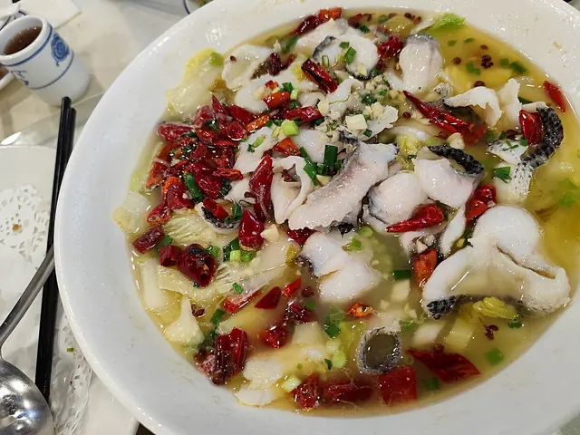 <code>suan-cai-yu-v2.webp</code> | 由门店外景改为鱼片、酸菜与泡椒清楚的成品汤菜。 |
| 兰州牛肉面 | 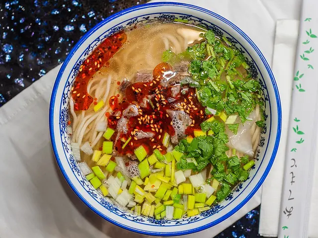 <code>lanzhou-beef-noodles-v2.webp</code> | 由门店外景改为牛肉、拉面、香菜与辣油清楚的成品。 |
| 皮蛋瘦肉粥 | 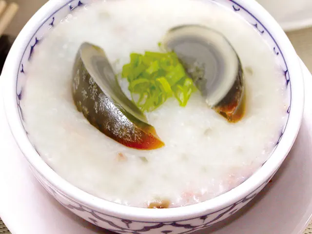 <code>century-egg-pork-congee-v2.webp</code> | 由非粥汤菜改为皮蛋粥成品。 |
| 冬瓜排骨汤 | 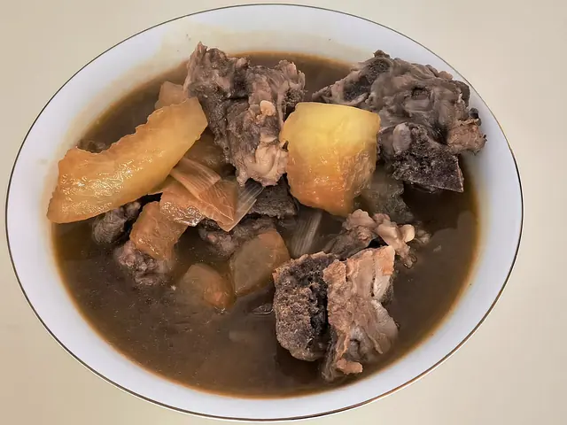 <code>winter-melon-ribs-soup-v2.webp</code> | 由冬瓜虾仁汤改为冬瓜与排骨同时清楚的汤品。 |
| 腊味煲仔饭 | 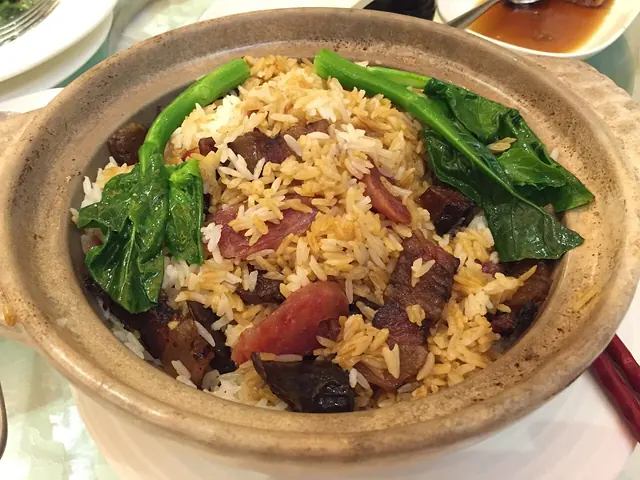 <code>claypot-sausage-rice-v2.webp</code> | 由焗菜近似图改为砂锅、米饭与腊肠清楚的煲仔饭。 |
| 冬阴功汤 | 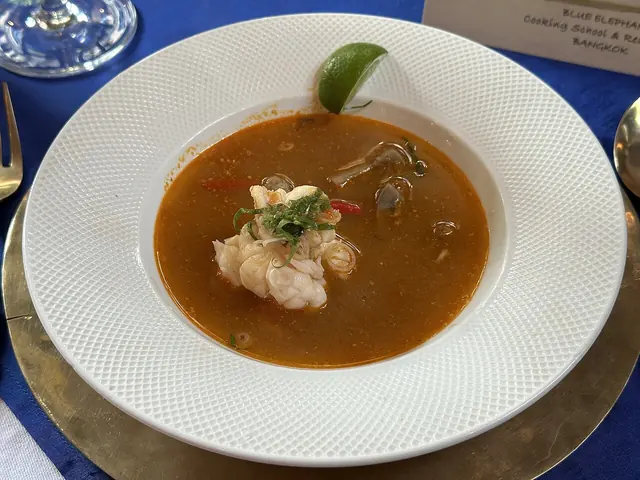 <code>tom-yum-prawn-v2.webp</code> | 由虾与青柠局部近景改为完整冬阴功汤摆盘。 |
| 艇仔粥 | 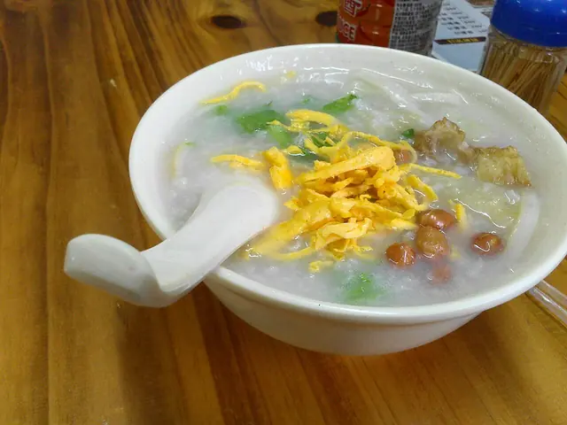 <code>boat-congee-v2.webp</code> | 由虾盘与茶具改为粥体、蛋丝、花生和肉料清楚的成品。 |
| 大拉皮 | 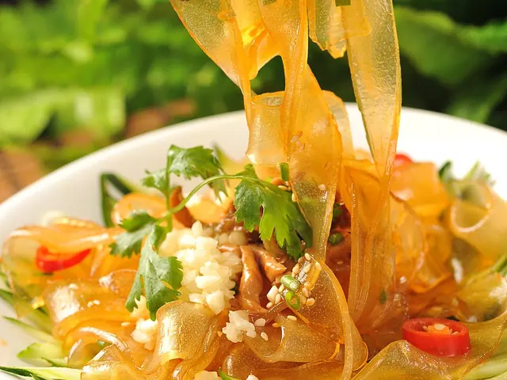 <code>dongbei-da-la-pi-v2.webp</code> | 由海鲜沙拉改为宽粉、黄瓜、香菜与酱汁清楚的东北大拉皮。 |
| 菜肉馄饨 | 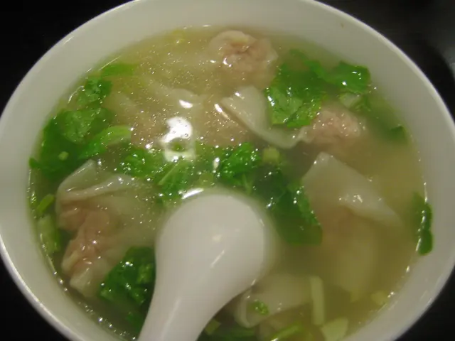 <code>pork-vegetable-wonton-v2.webp</code> | 由糊状食物改为馄饨、猪肉与绿叶菜清楚的汤品。 |
| 梅干菜蒸排骨 | 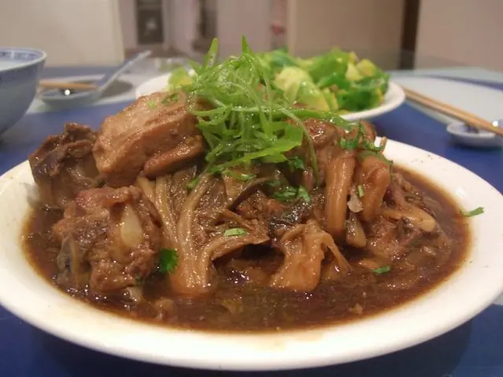 <code>mei-cai-ribs-v2.webp</code> | 由青菜红烧肉改为梅菜与排骨同时清楚的成品；来源烹调说明为焖/烧。 |
| 南瓜玛芬 | 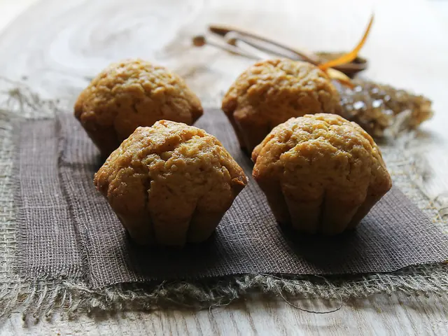 <code>pumpkin-muffin-v2.webp</code> | 由圆面包近似图改为来源标题明确的南瓜香料玛芬。 |
| 钵钵鸡 | 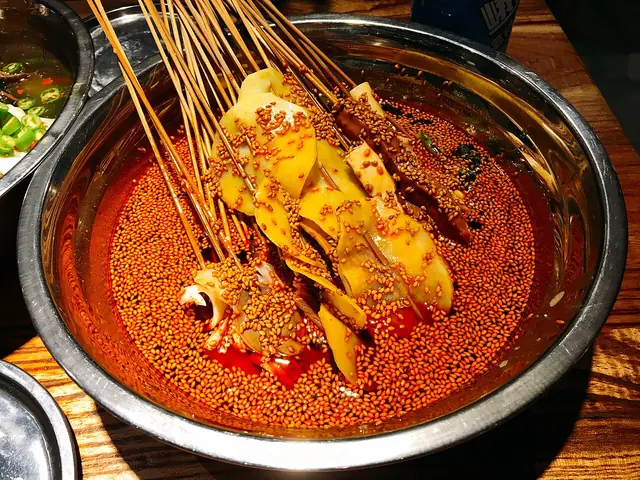 <code>red-oil-bobo-chicken-v2.webp</code> | 由生鲜串串摊位改为红油汤底中的熟制钵钵鸡串。 |
| 牛肉小炒泡馍 | 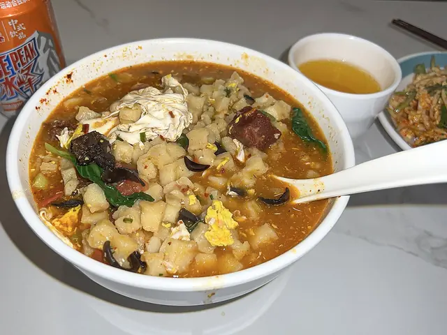 <code>xiaochao-paomo-v2.webp</code> | 由橙色浓汤配香肠改为原作标题明确的小炒泡馍。 |
| 豆花牛肉 | 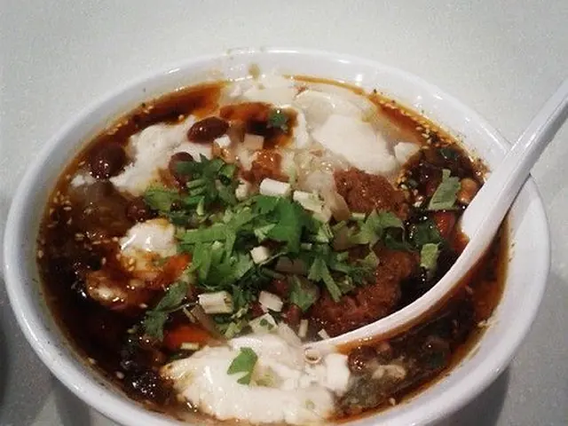 <code>beef-douhua-v2.webp</code> | 由无牛肉豆腐煲改为豆花、牛肉末、红油与香菜清楚的成品。 |
| 全麦馒头 | 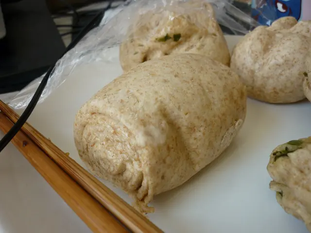 <code>wholegrain-mantou-v2.webp</code> | 由灰色方块糕点改为来源标题明确的全麦刀切馒头。 |
| 麻辣鸭血粉丝汤 | 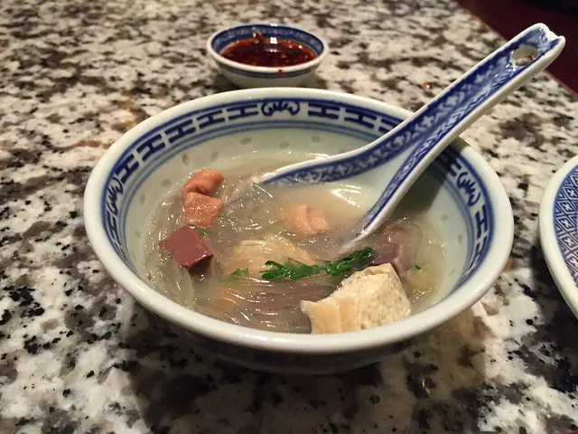 <code>duck-blood-vermicelli-v2.webp</code> | 补齐原图缺失的粉丝主体，鸭血、豆泡与汤体同时可辨。 |
| 啫啫鸡煲 | 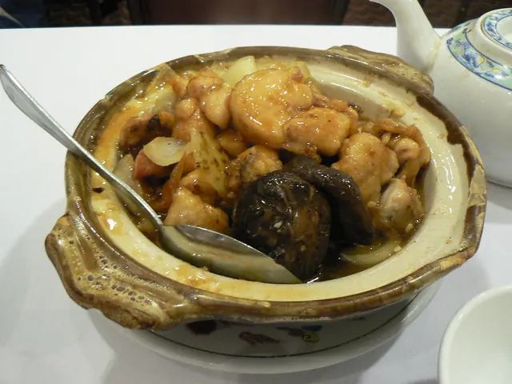 <code>sizzling-chicken-claypot-v2.webp</code> | 由面包焗盘近似图改为鸡块、冬菇与砂锅清楚的鸡煲。 |
| 玉米须茶 | 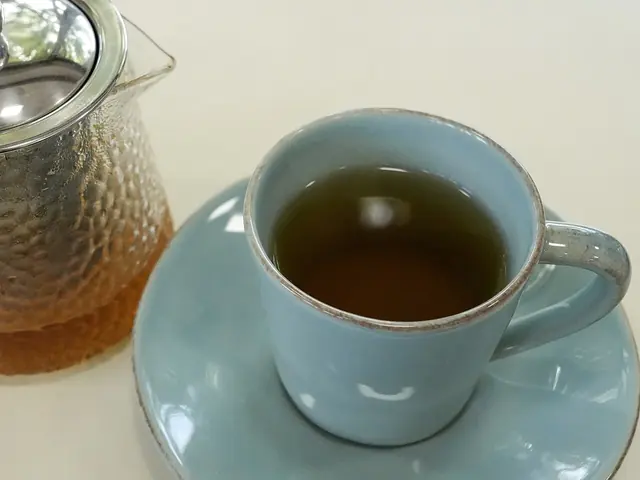 <code>corn-silk-tea-v2.webp</code> | 由糕点遮挡茶杯改为茶杯与茶壶完整、来源标题明确的玉米须茶。 |

## 已完成替换｜2026-07-24 第二批

本批继续从 Flickr、Pexels 及 Wikimedia Commons 候选中交叉筛选，最终采用 18 张原作页许可清楚、菜品主体完整的实拍。入库前剔除 7 张与项目既有素材同源的候选，并对最终 4:3 WebP 再做项目历史库与批内感知哈希复核。

| 菜名 | 新图片 | 改善点 |
|---|---|---|
| 干锅牛蛙 | 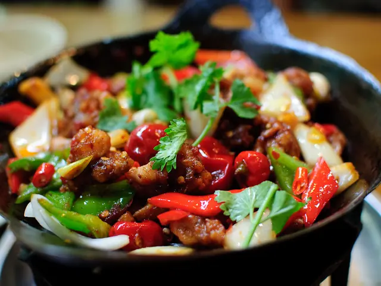 <code>dry-pot-frog-v3.webp</code> | 由三份套餐菜改为来源标题明确的干锅牛蛙，牛蛙与青红椒成品清晰。 |
| 白菜炖粉条 | 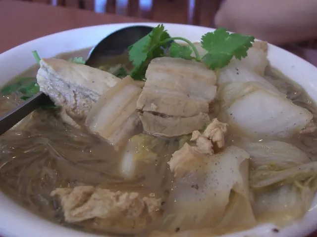 <code>cabbage-glass-noodle-stew-v2.webp</code> | 由无粉条肉丸汤改为白菜、粉条和猪肉同锅的炖菜。 |
| 口蘑牛肉片 | 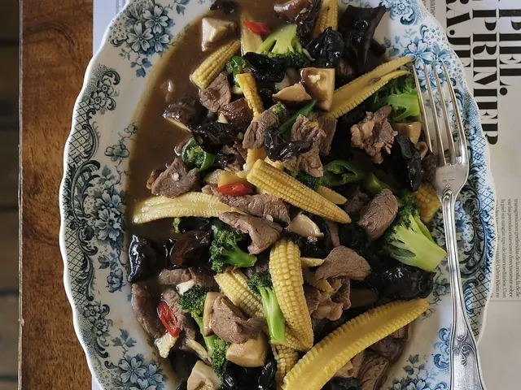 <code>button-mushroom-beef-v2.webp</code> | 由牛排饭改为牛肉片与口蘑同时清楚的炒菜。 |
| 香菇青菜 | 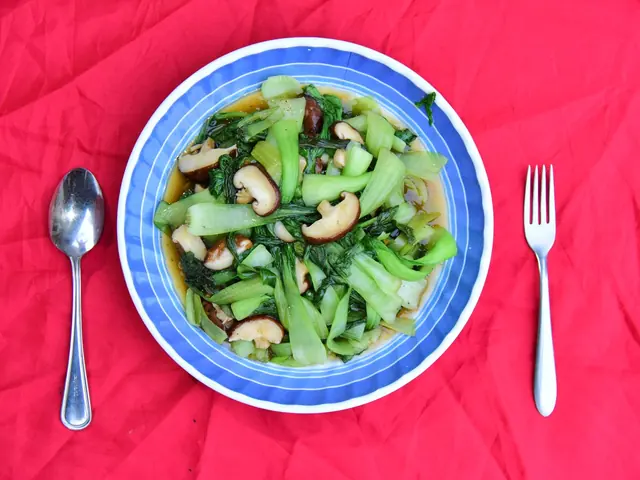 <code>shiitake-bok-choy-v2.webp</code> | 补齐原图缺失的香菇主体，青菜与香菇同盘清晰。 |
| 宫保鸡丁少糖版 | 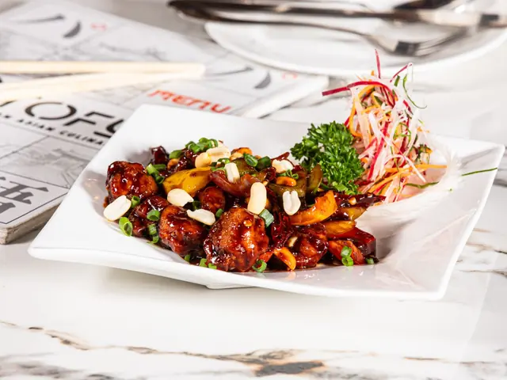 <code>kung-pao-chicken-v2.webp</code> | 改为来源标题明确的宫保鸡丁，鸡丁、花生与辣椒识别点完整。 |
| 烤羊肉串饭 | 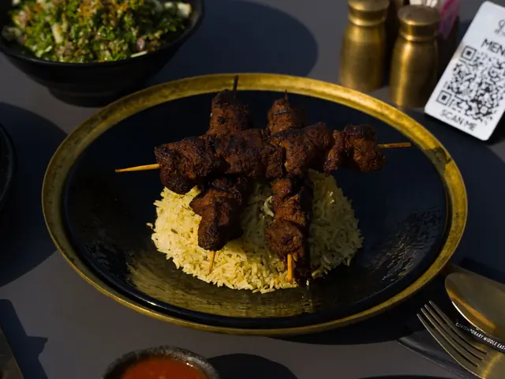 <code>lamb-skewer-rice-v2.webp</code> | 由只有香料饭改为烤肉串与米饭同时完整入镜。 |
| 番茄炒蛋 | 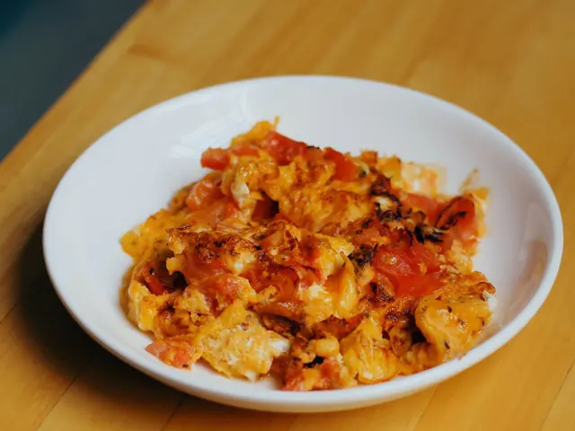 <code>tomato-eggs-v2.webp</code> | 由灰黄低清旧图改为番茄与炒蛋颜色自然、主体完整的成品。 |
| 咖喱鸡饭 | 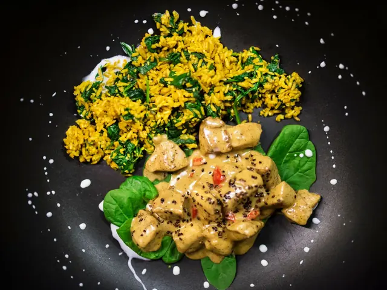 <code>chicken-curry-rice-v2.webp</code> | 改为鸡肉咖喱与米饭同盘、光线和摆盘干净的成品。 |
| 孜然羊肉串 | 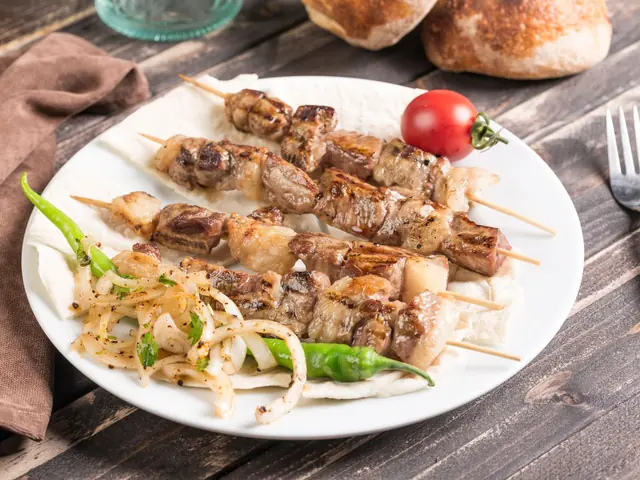 <code>lamb-skewers-v2.webp</code> | 由杂乱配菜图改为羊肉串占据主体的完整摆盘。 |
| 蒜蓉粉丝虾 | 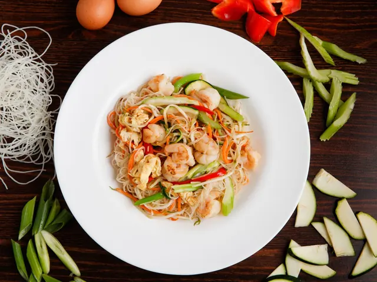 <code>garlic-vermicelli-shrimp-v2.webp</code> | 由单只虚焦虾改为虾仁与粉丝完整清晰的俯拍成品。 |
| 虾仁滑蛋 | 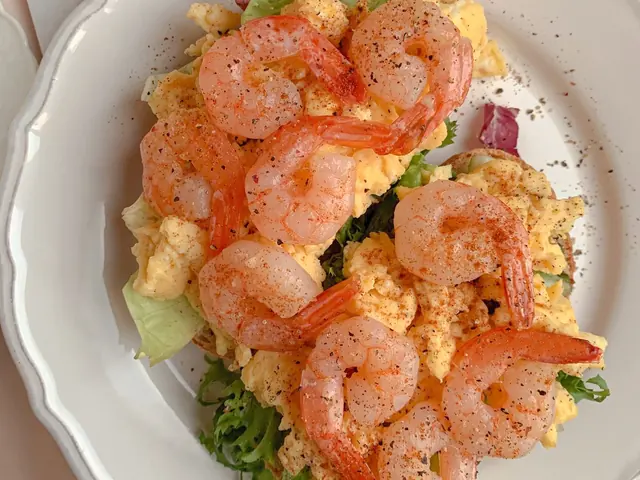 <code>shrimp-scrambled-eggs-v2.webp</code> | 由偏暗偏糊改为虾仁与滑蛋质感清楚的近景。 |
| 家常豆腐 | 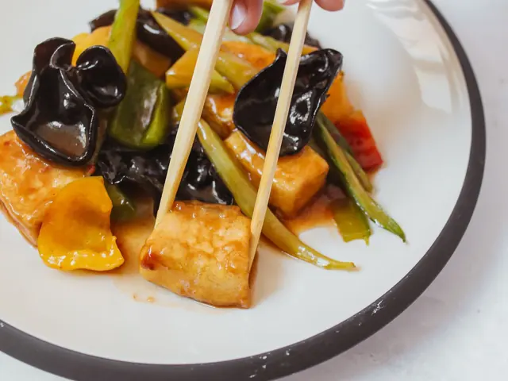 <code>home-style-tofu-v2.webp</code> | 由黑背景闪光照改为豆腐、木耳与彩椒清楚的明亮成品。 |
| 蒜香烤茄子 | 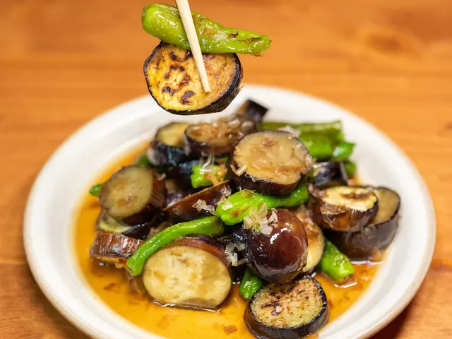 <code>garlic-grilled-eggplant-v2.webp</code> | 由一小片残余茄子改为整盘熟制茄子与青椒。 |
| 香蕉可可杯 | 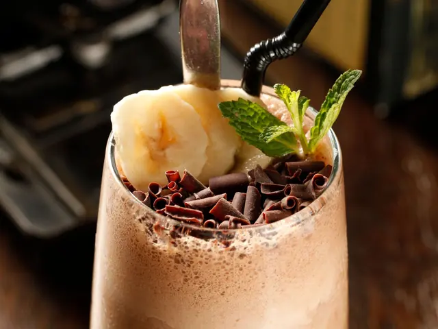 <code>banana-cocoa-cup-v2.webp</code> | 由手持模糊残余杯改为香蕉、可可与完整杯体清楚的成品饮品。 |
| 牛油果鸡蛋吐司 | 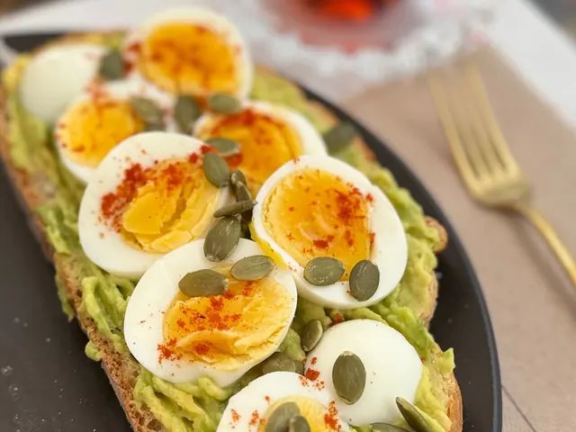 <code>avocado-egg-toast-v2.webp</code> | 由鸡蛋极端近景改为整片吐司、牛油果与鸡蛋完整入镜。 |
| 可可燕麦曲奇 | 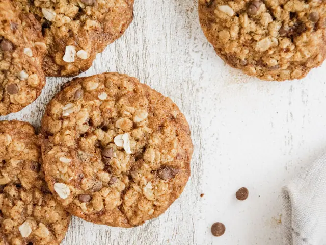 <code>cocoa-oat-cookies-v2.webp</code> | 由深色面团球改为多枚烤熟燕麦巧克力曲奇。 |
| 南瓜拿铁无糖版 |  <code>pumpkin-latte-v2.webp</code> | 由昏暗原料记录照改为杯体、奶泡与南瓜完整的俯拍。 |
| 低糖芝士蛋糕 | 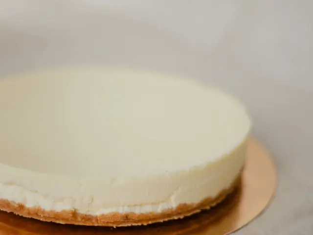 <code>low-sugar-cheesecake-v2.webp</code> | 由主体过小、留白过大改为完整芝士蛋糕近景。 |

## 已完成替换｜2026-07-24 第三批

本批按每日 20 张、一次上传的节奏，从 Pexels 与 Wikimedia Commons 多站候选中完成 20 张优选。所有原作页均已核验许可；最终 640×480 WebP 通过 SHA-256、aHash 与 dHash 的项目历史库及批内复核，另剔除燕麦豆浆、芹菜炒鸡丝、花卷等同源裁切候选。

| 菜名 | 新图片 | 改善点 |
|---|---|---|
| 黑椒牛排饭 | 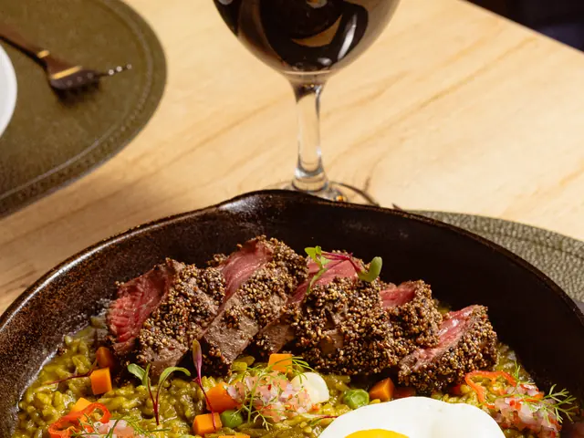 <code>steak-rice-v2.webp</code> | 由外卖餐盒改为牛排与米饭完整清晰的餐厅摆盘。 |
| 烤蔬菜鸡腿 | 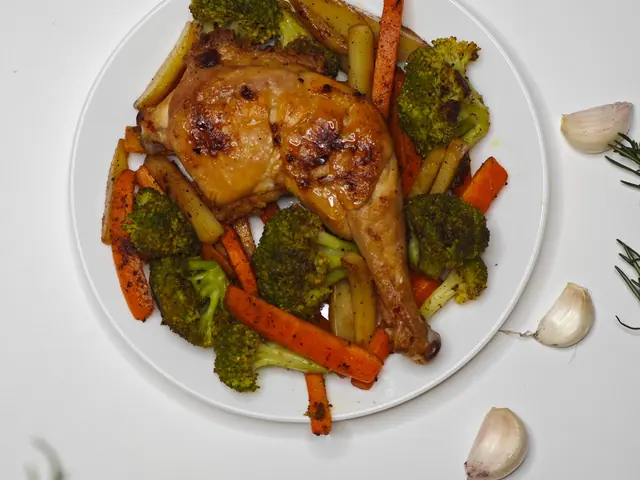 <code>roast-chicken-veg-v2.webp</code> | 改为鸡腿、西兰花、胡萝卜和土豆同时清楚的完整成品。 |
| 鸡胸玉米沙拉 | 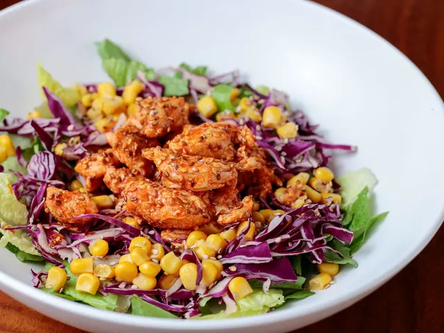 <code>chicken-corn-salad-v2.webp</code> | 由边缘裁切近景改为鸡肉、玉米和卷心菜完整入镜。 |
| 红枣姜茶 | 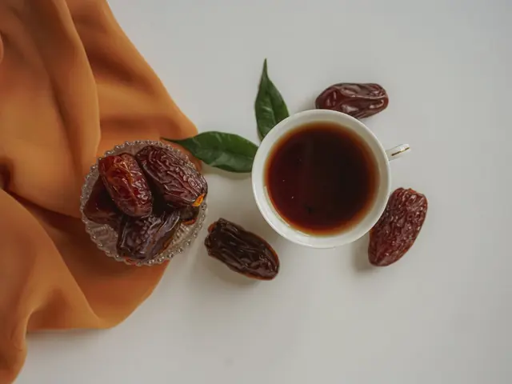 <code>red-date-tea-v2.webp</code> | 由背景杂乱旧图改为红枣与茶杯清楚的干净俯拍。 |
| 葱香咸司康 | 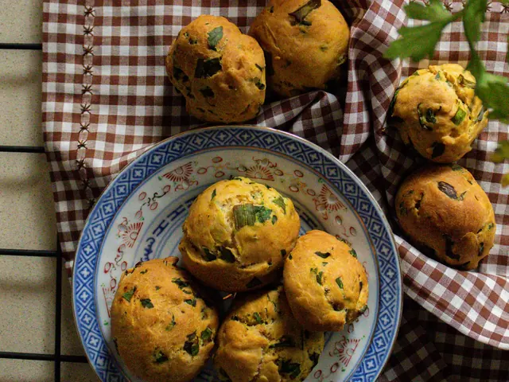 <code>scallion-scones-v2.webp</code> | 由灰褐小点心改为多枚香草咸司康成品。 |
| 白灼菜心 | 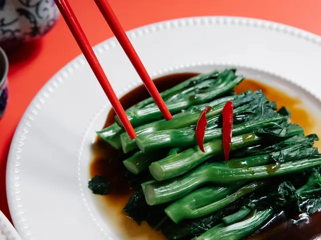 <code>blanched-choy-sum-v2.webp</code> | 由腰果炒青菜改为酱汁清楚、无杂料的整盘绿叶菜。 |
| 番茄土豆炖牛肉 | 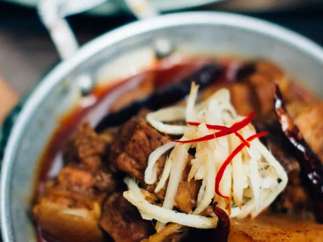 <code>beef-potato-stew-v2.webp</code> | 改为红汤中的牛肉与土豆主体，食材识别度更高。 |
| 番茄牛腩 | 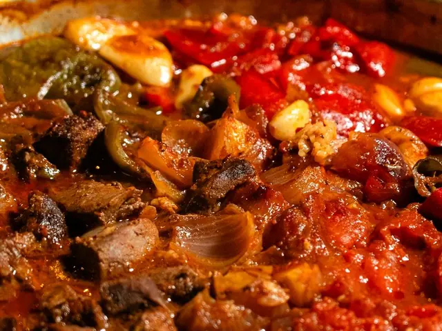 <code>tomato-beef-stew-v2.webp</code> | 由无番茄土豆牛肉图改为番茄、牛肉与彩椒清楚的炖菜。 |
| 土豆牛肉焖饭 | 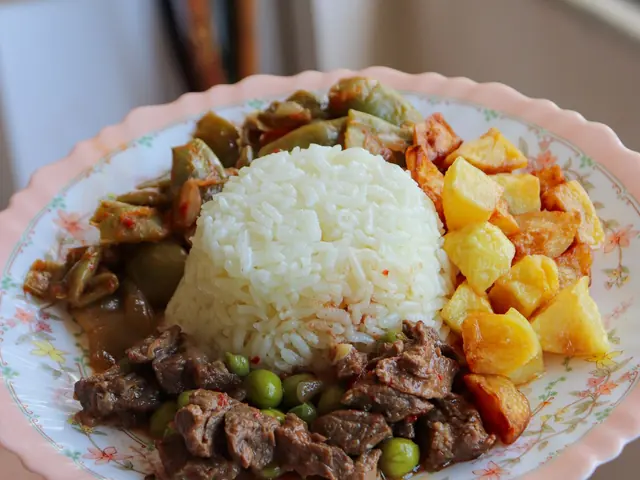 <code>beef-potato-rice-v2.webp</code> | 改为米饭、牛肉与土豆主体更集中清楚的完整餐盘。 |
| 胡辣汤 | 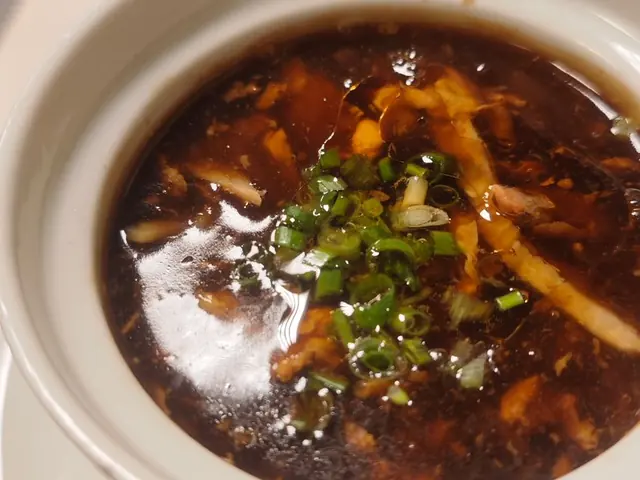 <code>hot-sour-soup-v2.webp</code> | 由黑碗大留白改为明亮近景，汤体、蛋花与菌菇清楚。 |
| 香蕉燕麦奶昔 | 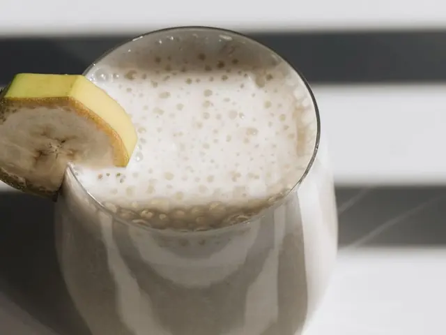 <code>banana-oat-smoothie-v2.webp</code> | 由手部加工图改为完整奶昔杯与香蕉切片。 |
| 蒜蓉蒸扇贝 | 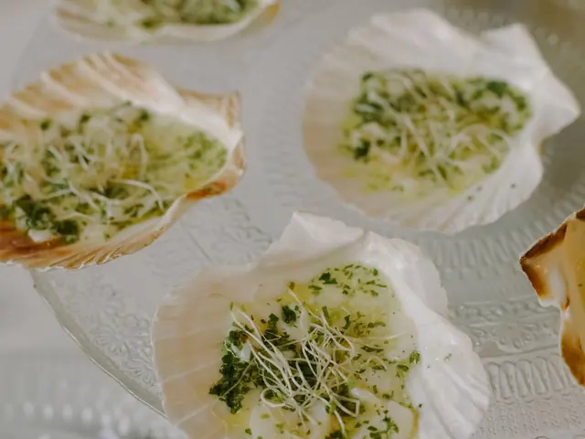 <code>garlic-scallops-v2.webp</code> | 由混合海鲜锅改为扇贝壳与贝肉占据主体的整盘成品。 |
| 青菜鸡蛋面 | 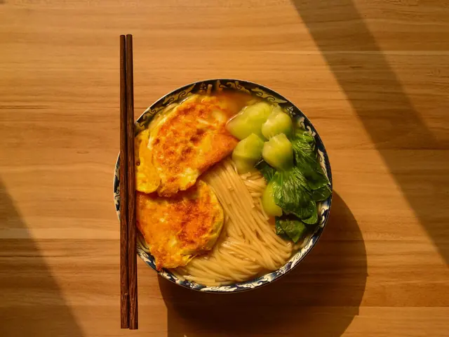 <code>egg-green-noodles-v2.webp</code> | 改为面条、鸡蛋与青菜同时清楚的完整面碗。 |
| 莲藕排骨汤 | 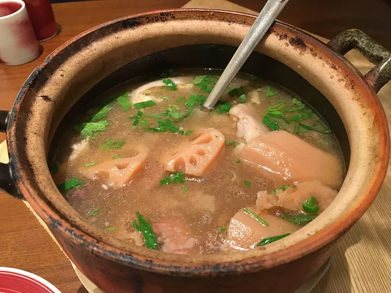 <code>lotus-root-soup-v2.webp</code> | 由大段虚焦改为莲藕、猪骨与砂锅汤体清楚的成品。 |
| 草莓气泡水 | 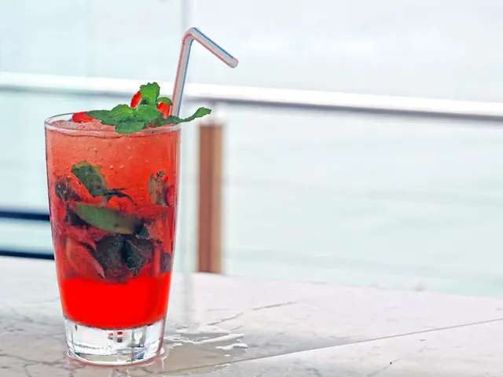 <code>strawberry-soda-v2.webp</code> | 由过曝近空杯改为草莓、薄荷与完整透明饮品杯。 |
| 原味玛芬 | 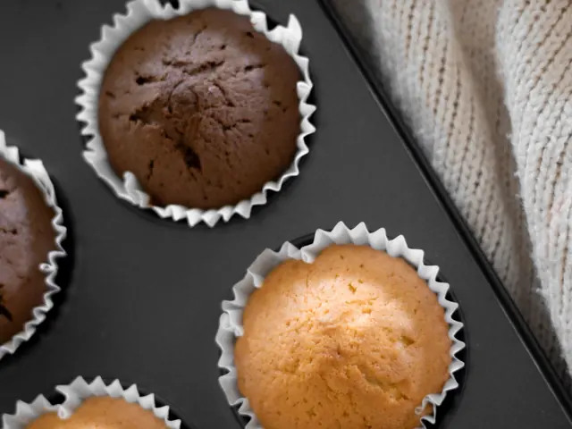 <code>plain-muffin-v2.webp</code> | 由主体缺失改为多枚完整玛芬，原味成品居中清楚。 |
| 绿豆汤少糖版 | 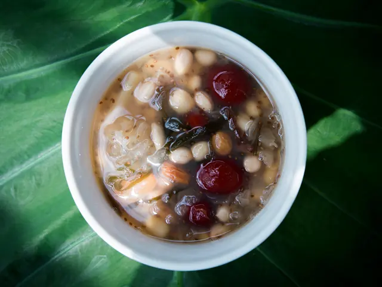 <code>mung-bean-soup-v2.webp</code> | 由寡淡灰白旧图改为豆料丰富、俯拍完整的甜汤。 |
| 清炒油菜 | 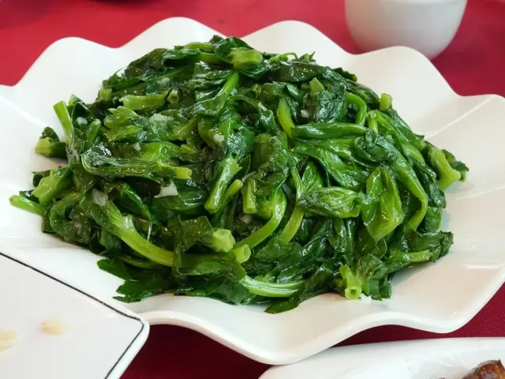 <code>stir-fried-greens-v2.webp</code> | 由含肉旧图改为无肉、色泽自然的整盘清炒绿叶菜。 |
| 凉拌米线 | 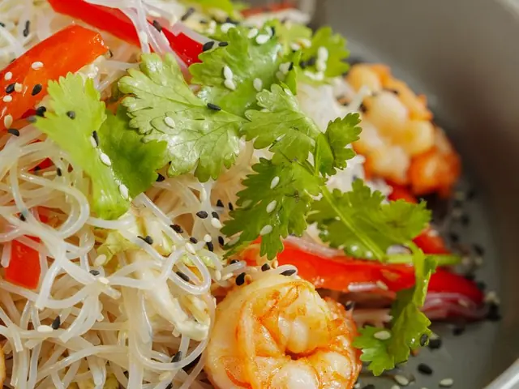 <code>cold-rice-noodle-salad-v2.webp</code> | 由桌面杂乱小盘改为米线、香草、彩椒和虾仁完整近景。 |
| 蒜香茄条 | 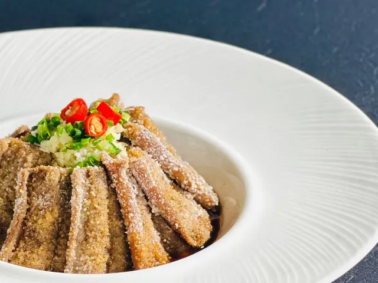 <code>garlic-eggplant-v2.webp</code> | 由少量干瘪茄条改为蒜蓉、辣椒与条状茄子清楚的成品。 |

## 已完成替换｜2026-07-24 第四批

本批按每日 20 张、一次上传的节奏，优先处理错图与低品质图。候选均回到 Pexels 或 Wikimedia Commons 原作页核验；最终 640×480 WebP 通过 SHA-256、aHash 与 dHash 的全库及批内复核。筛选中另淘汰了带品牌、人物手部、主料缺失、成品形态错误和 2 张项目内同源裁切图。

| 菜名 | 新图片 | 改善点 |
|---|---|---|
| 干锅藕片 | 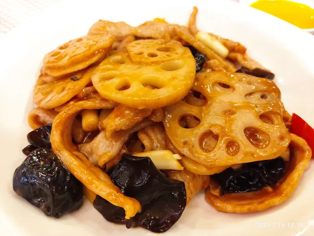 <code>dry-pot-lotus-root-v2.webp</code> | 由看不出藕片的煎物改为莲藕片、木耳与酱汁清楚的炒制成品。 |
| 干锅花甲 | 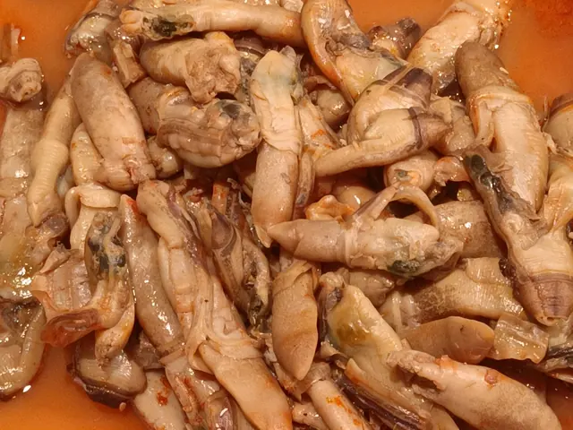 <code>dry-pot-clams-v2.webp</code> | 由带汤花甲改为香辣贝类占满画面的干式成品近景。 |
| 扬州炒饭 | 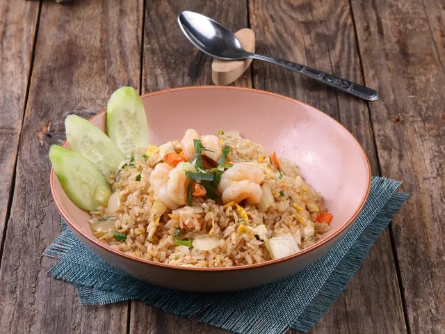 <code>yangzhou-fried-rice-v2.webp</code> | 去除饮料罐和杂物，改为虾仁、鸡蛋与米饭主体完整的干净摆盘。 |
| 苦瓜炒蛋 | 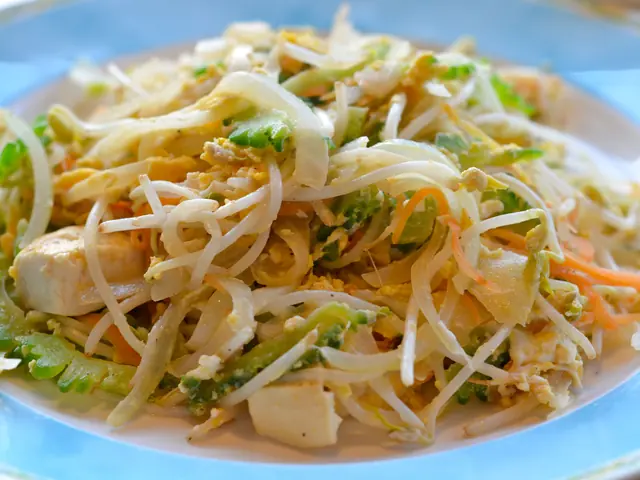 <code>bitter-melon-eggs-v2.webp</code> | 由发灰糊成一团改为苦瓜与鸡蛋结构清楚、颜色自然的成品。 |
| 陈皮普洱茶 | 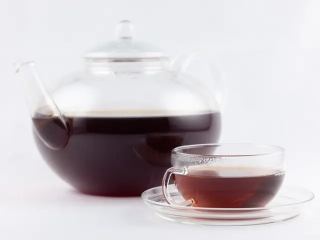 <code>chenpi-puer-tea-v2.webp</code> | 去除品牌茶饼包装，改为透明茶壶与茶杯的无品牌成品图。 |
| 香葱司康 | 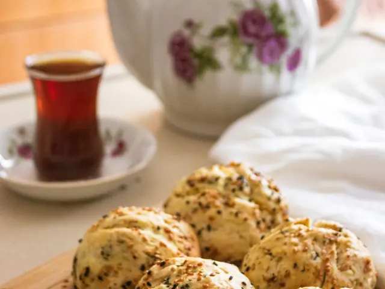 <code>scallion-scone-v2.webp</code> | 由少量灰暗点心改为多枚咸味香草司康近景。 |
| 红薯布朗尼 | 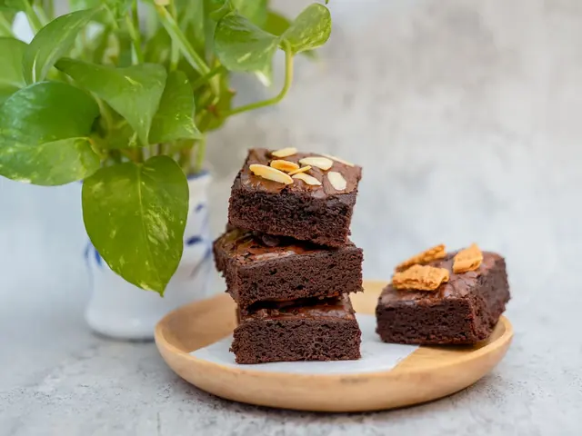 <code>sweet-potato-brownie-v2.webp</code> | 由主体过小的配料场景改为多块完整布朗尼干净摆盘。 |
| 干煸土豆条 | 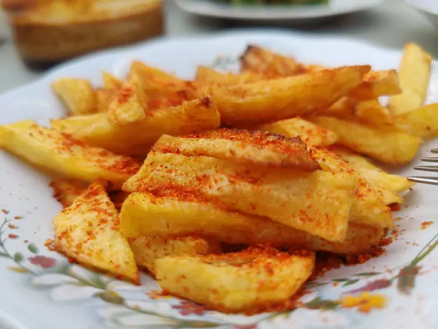 <code>dry-fried-potato-strips-v2.webp</code> | 由油腻焦黑的一团改为形态分明、椒粉清楚的金黄土豆条。 |
| 鸡肉芝士面包 | 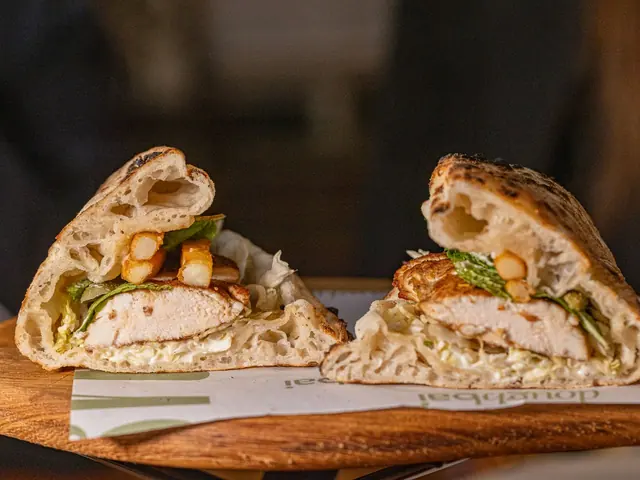 <code>chicken-cheese-bread-v2.webp</code> | 由被咬开的极端近景改为鸡肉、芝士与面包切面完整可见。 |
| 椒盐排骨 | 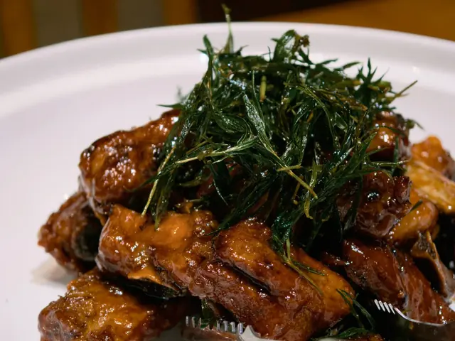 <code>pepper-salt-ribs-v2.webp</code> | 由份量少、留白大的干硬排骨改为主体饱满的排骨近景。 |
| 砂锅白菜豆腐 | 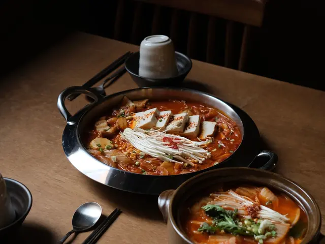 <code>cabbage-tofu-casserole-v2.webp</code> | 由寡淡清水豆腐改为白菜、豆腐与菌菇层次清楚的热锅成品。 |
| 菌菇豆腐汤 | 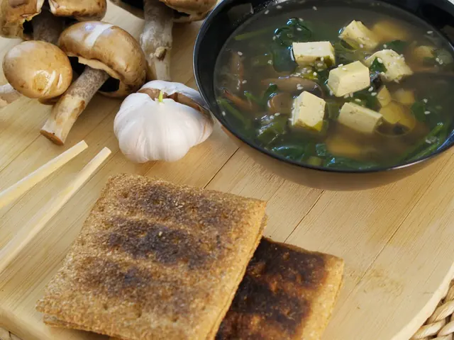 <code>mushroom-tofu-soup-v2.webp</code> | 由备菜现场改为菌菇、豆腐与汤体清楚的完整成品。 |
| 烤鸡皮 | 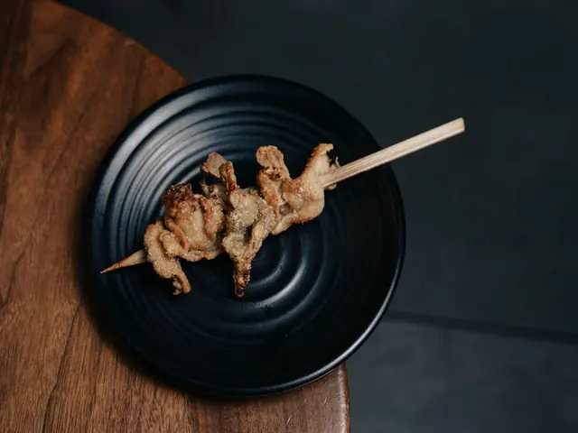 <code>grilled-chicken-skin-v2.webp</code> | 由零碎空盘改为串烤鸡肉主体集中的深色餐盘。 |
| 椰香南瓜露 | 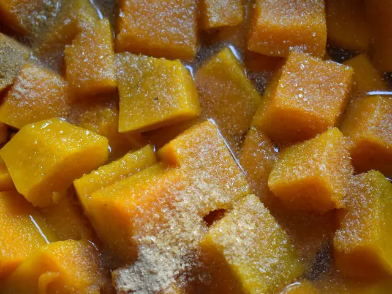 <code>coconut-pumpkin-dessert-v2.webp</code> | 由暗光撒糖南瓜改为来源明确的椰奶南瓜甜品近景。 |
| 燕麦豆浆 | 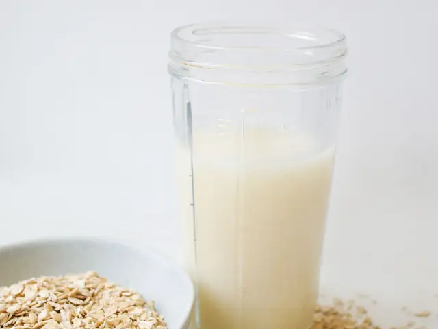 <code>oat-soy-milk-v2.webp</code> | 由只剩杯角的空白构图改为燕麦与完整白色饮品杯。 |
| 阳春面 | 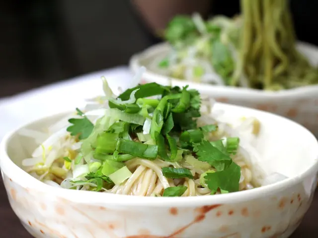 <code>plain-scallion-noodles-v2.webp</code> | 由暗光遮挡图改为细面、葱与青菜清晰的明亮面碗。 |
| 奶盐小餐包 | 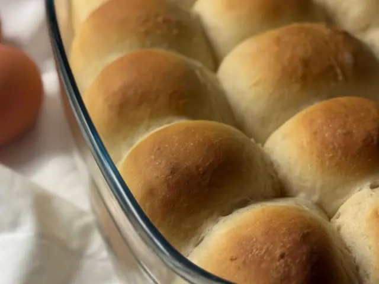 <code>milk-salt-dinner-rolls-v2.webp</code> | 由油炸圆球错图改为一盘完整金黄小餐包。 |
| 香葱肉松面包 | 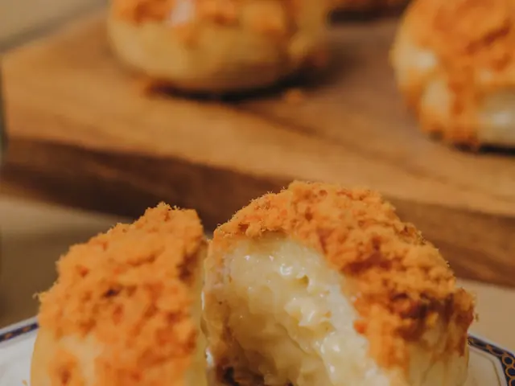 <code>scallion-pork-floss-bread-v2.webp</code> | 由单个局部切面改为肉松、面包与夹馅清楚的完整近景。 |
| 小锅米线 | 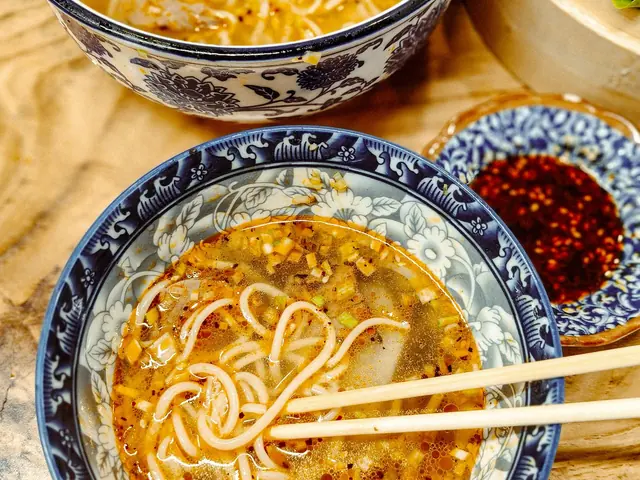 <code>small-pot-rice-noodles-v2.webp</code> | 由低清灰暗俯拍改为两碗辣汤米线完整清晰的成品。 |
| 冬瓜茶少糖版 | 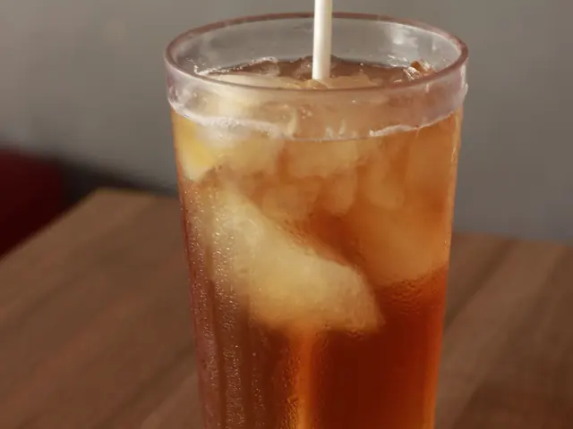 <code>winter-melon-tea-v2.webp</code> | 去除手部、品牌和一次性包装，改为无品牌完整冰茶杯。 |

## 已完成替换｜2026-07-25 第五批

本批按每批 20 张连续处理，优先清除确定性错图。候选均回到 Pexels 或 Wikimedia Commons 原作页核验；最终 640×480 WebP 通过 SHA-256、aHash 与 dHash 的全库及批内复核。筛选中淘汰了与项目既有图片同源的鸡蛋蔬菜饼、鸡肉沙拉和炒米粉候选，并对南瓜粥改用紧裁版本突出成品主体。

| 菜名 | 新图片 | 改善点 |
|---|---|---|
| 鸡蛋蔬菜饼 | 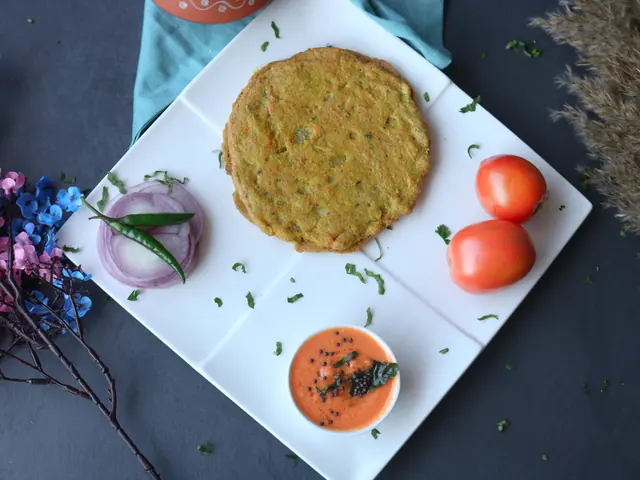 <code>egg-vegetable-pancake-v2.webp</code> | 由分层烤饼错图改为完整蔬菜煎饼俯拍成品。 |
| 豆花面 | 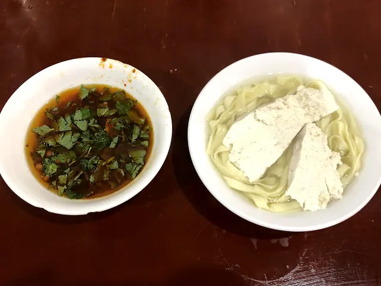 <code>douhua-noodles-v2.webp</code> | 改为来源标题明确的豆花面，豆花、面条与蘸水同时可见。 |
| 折耳根拌鸡丝 | 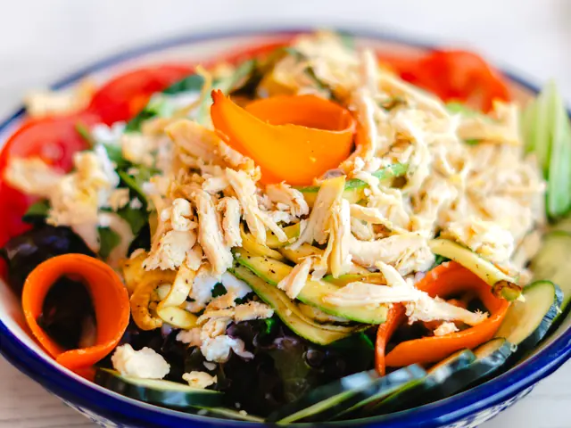 <code>fish-mint-chicken-salad-v2.webp</code> | 由复用海带鸡丝图改为细鸡丝、黄瓜与鲜蔬结构清楚的凉拌成品。 |
| 菠菜瘦肉粥 | 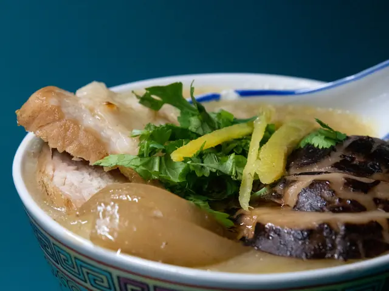 <code>spinach-pork-congee-v2.webp</code> | 由非粥汤菜改为来源明确的猪肉粥成品，补齐粥体与猪肉主体。 |
| 青椒炒鸡蛋 | 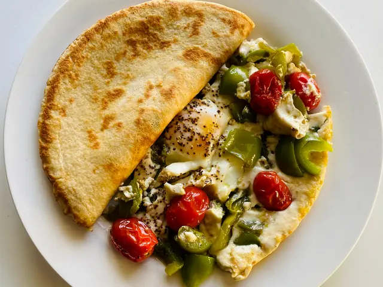 <code>green-pepper-eggs-a-v2.webp</code> | 由韭菜炒蛋错图改为青椒与鸡蛋同时清楚的煎制成品。 |
| 青椒鸡蛋 | 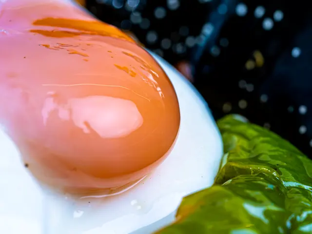 <code>green-pepper-eggs-b-v2.webp</code> | 使用另一张独立来源的青椒煎蛋近景，避免与青椒炒鸡蛋共图。 |
| 南瓜小米粥 | 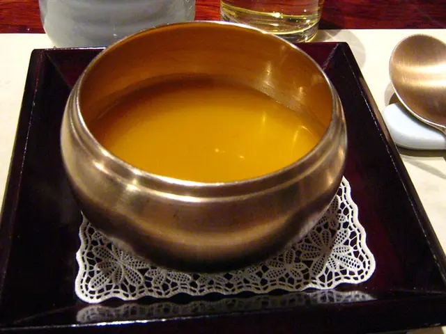 <code>pumpkin-millet-porridge-v2.webp</code> | 改为来源明确的南瓜粥，并紧裁到橙黄色粥体主体。 |
| 青菜瘦肉粥 | 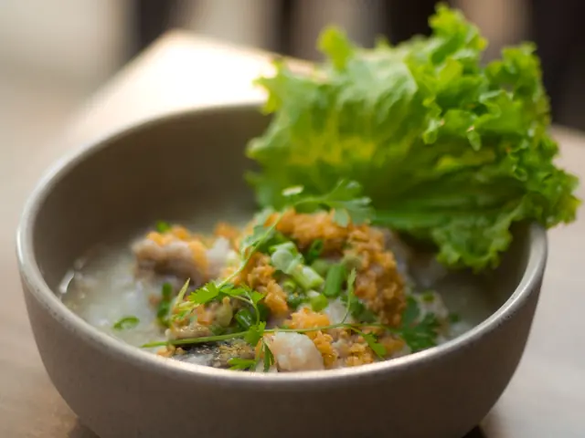 <code>greens-pork-congee-v2.webp</code> | 由猪肉菌菇汤错图改为青菜与肉粥形态清楚的成品。 |
| 黑芝麻豆浆 | 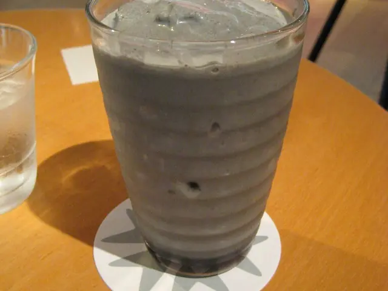 <code>black-sesame-soy-milk-v2.webp</code> | 由白豆浆黄豆图改为黑芝麻灰色饮品主体。 |
| 鸡蛋火腿炒米粉 | 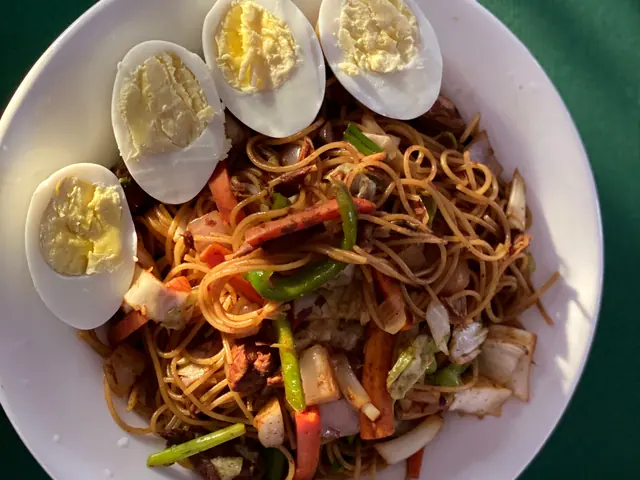 <code>ham-egg-fried-rice-noodles-v2.webp</code> | 由分装食材改为鸡蛋、条状肉料与面条完整的炒制成品。 |
| 干锅排骨虾 | 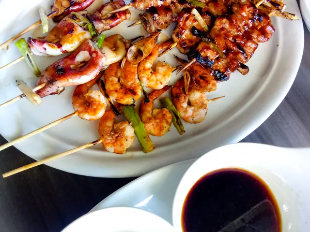 <code>dry-pot-ribs-shrimp-v2.webp</code> | 由叉烧汤面错图改为熟虾与多种烤肉同盘的干式成品。 |
| 白菜粉丝汤 | 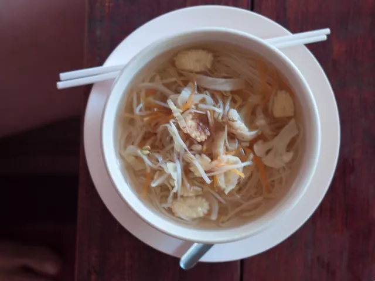 <code>cabbage-glass-noodle-soup-v2.webp</code> | 改为来源明确的白菜粉丝汤，白菜、粉丝与汤体同时清楚。 |
| 冬菇蒸鸡 | 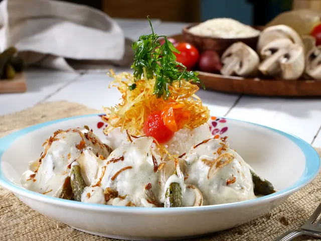 <code>winter-mushroom-steamed-chicken-v2.webp</code> | 由无冬菇鸡肉饭改为鸡肉与整颗蘑菇同时清楚的成品。 |
| 香菇蒸鸡 | 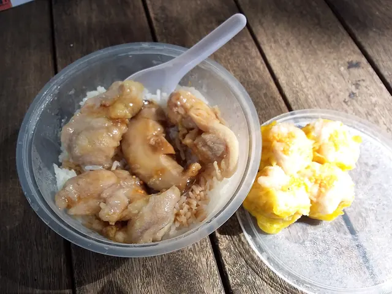 <code>shiitake-steamed-chicken-v2.webp</code> | 改为来源分类明确的香菇蒸鸡饭，并裁去大部分配菜。 |
| 玉米鸡肉粥 | 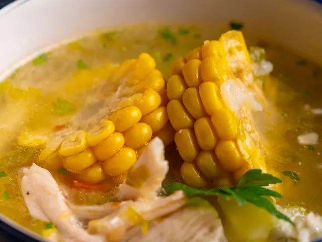 <code>corn-chicken-congee-v2.webp</code> | 由奶油浓汤配面包改为玉米、鸡肉与浓稠汤体同时清楚的成品。 |
| 冬瓜海鲜菇汤 | 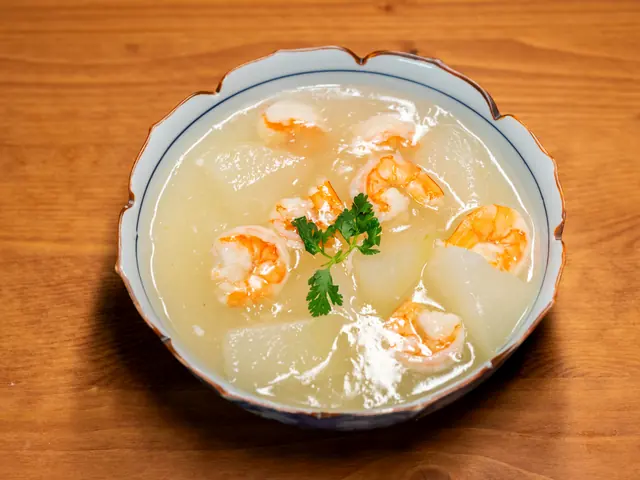 <code>winter-melon-seafood-mushroom-soup-v2.webp</code> | 由不明清汤肉块改为冬瓜与海鲜清汤主体，菜型识别更准确。 |
| 茭白炒肉丝 | 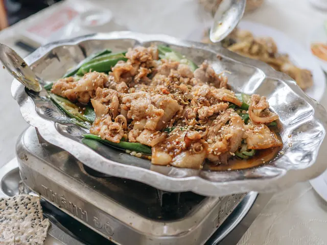 <code>water-bamboo-pork-v2.webp</code> | 由菠萝肉串错图改为中式猪肉与绿色蔬菜炒制成品。 |
| 清爽牛肉黄瓜卷 | 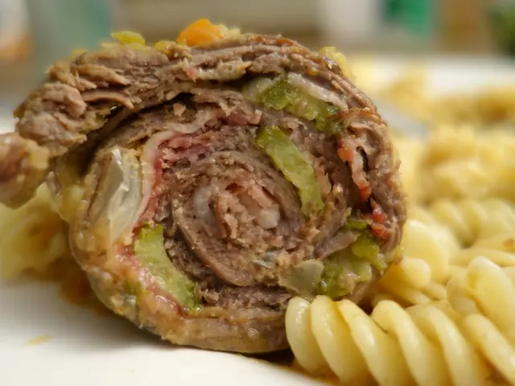 <code>beef-cucumber-rolls-v2.webp</code> | 改为熟牛肉卷剖面，卷层与腌黄瓜馅清晰可辨。 |
| 黄瓜木耳鸡丝 | 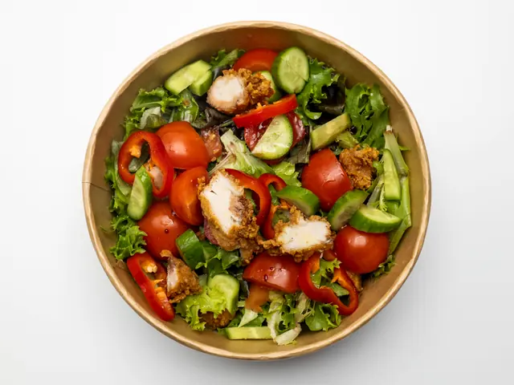 <code>cucumber-wood-ear-chicken-v2.webp</code> | 由整块炸鸡排改为鸡肉与黄瓜鲜蔬沙拉俯拍成品。 |
| 黄瓜豆腐拌鸡丝 | 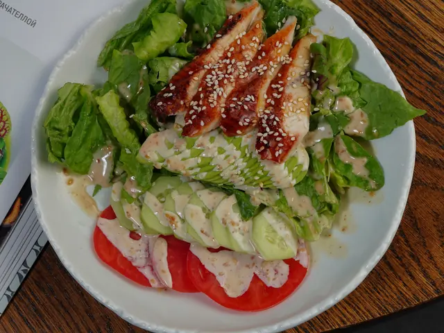 <code>cucumber-tofu-chicken-v2.webp</code> | 使用独立来源的鸡肉黄瓜沙拉，去除与上一道菜共用炸鸡排图的问题。 |

## 已完成替换｜2026-07-25 第六批

| 菜名 | 新图片 | 改善说明 |
|---|---|---|
| 酸菜炒粉 | 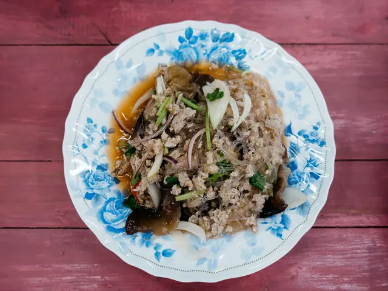 <code>sauerkraut-glass-noodle-salad-b31.webp</code> | 由汤菜错图改为白菜、细粉丝与肉末同盘成品。 |
| 鸡肉藜麦饭团 | 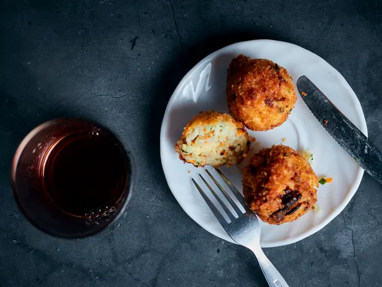 <code>chicken-quinoa-rice-balls-b31.webp</code> | 由沙拉错图改为完整饭团成品，先保证菜形一致。 |
| 毛豆烧鸡 | 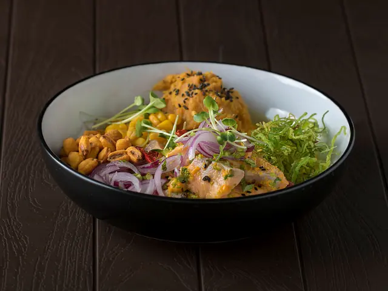 <code>edamame-chicken-grain-bowl-b31.webp</code> | 由煎饺炸鸡拼盘改为鸡肉谷物蔬菜碗，鸡肉主体更明确。 |
| 泡椒凤爪粉 | 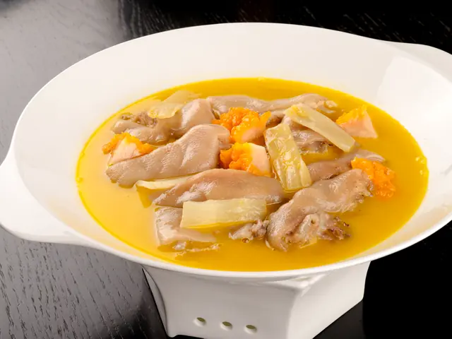 <code>pickled-chili-chicken-feet-noodles-b31.webp</code> | 改为来源标题明确的凤爪汤成品，去除红烧凤爪干盘错态。 |
| 烩麻食 | 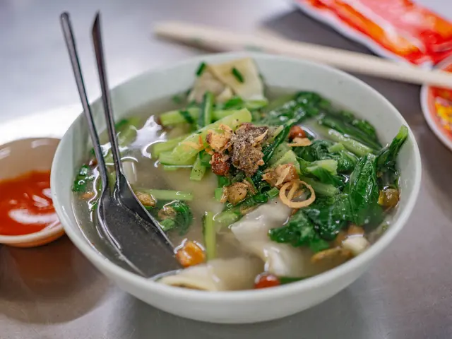 <code>ma-shi-vegetable-soup-b31.webp</code> | 由酸汤面片复用图改为蔬菜汤与面食块同碗成品。 |
| 花卷配卤牛肉 | 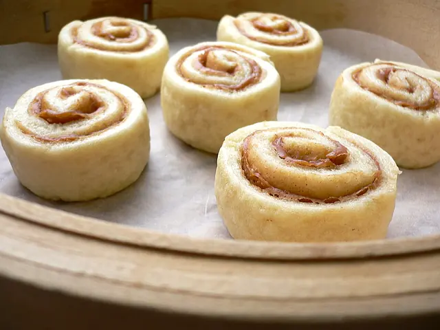 <code>flower-roll-braised-beef-b31.webp</code> | 改为独立来源的中式花卷实拍，解除与其他花卷共图。 |
| 土豆片夹馍 | 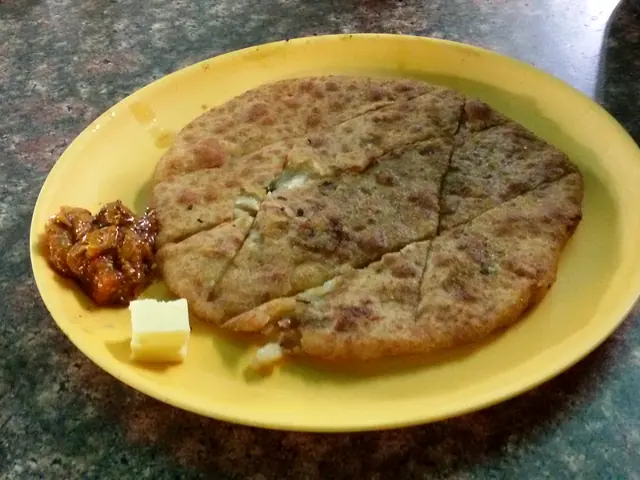 <code>potato-flatbread-sandwich-b31.webp</code> | 由土豆丝卷饼改为土豆馅面饼，主食形态更接近夹馍。 |
| 蒜蓉粉丝金针菇 | 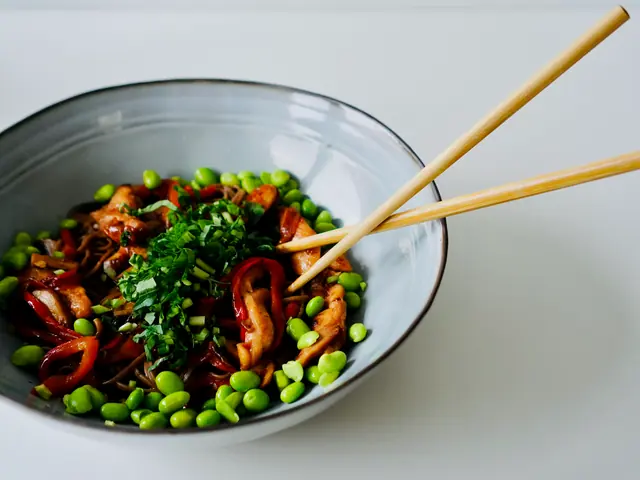 <code>garlic-enoki-vermicelli-b31.webp</code> | 改为金针菇与面条/粉丝同碗成品，补齐原图缺失的粉丝形态。 |
| 梅干菜肉末饭 | 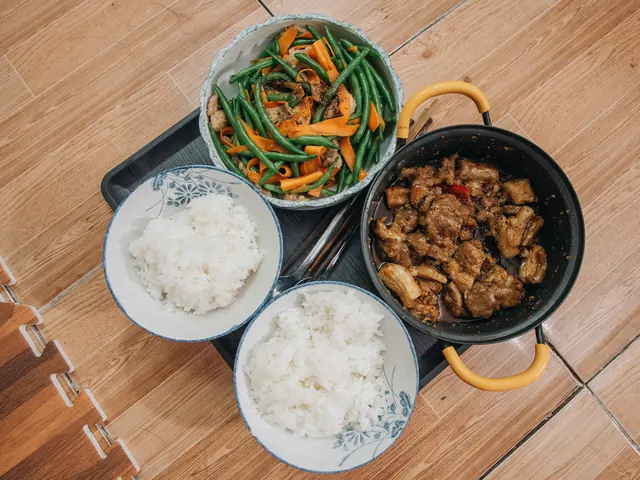 <code>preserved-mustard-pork-rice-b31.webp</code> | 由无米饭的红烧肉图改为猪肉与米饭完整套餐。 |
| 孜然烤馒头片 | 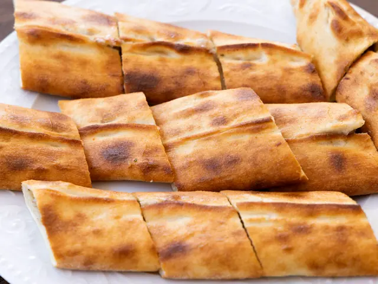 <code>cumin-baked-mantou-slices-b31.webp</code> | 由疑似炸面糊改为金黄烤制面饼切片。 |
| 爆辣鸭脖炒年糕 | 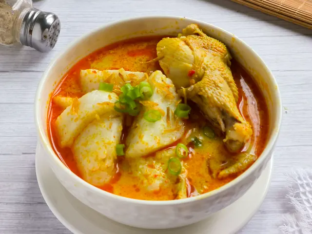 <code>spicy-duck-neck-rice-cake-b31.webp</code> | 由鸭脖拌面改为辣味肉类与年糕同碗成品，补齐年糕主体。 |
| 山药瘦肉粥 | 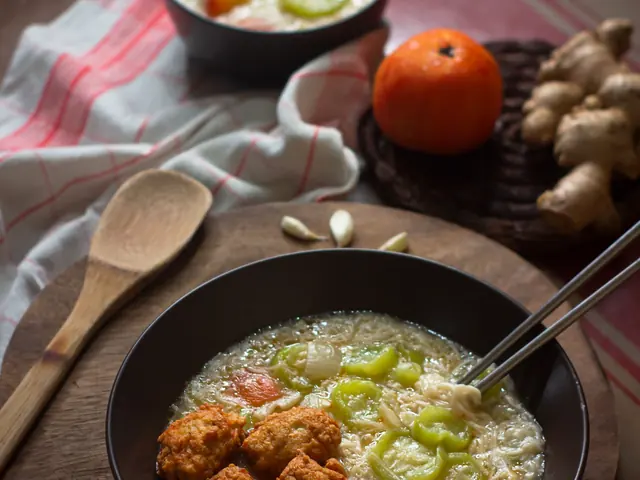 <code>yam-pork-congee-b31.webp</code> | 由菌菇汤错图改为浓稠亚洲咸粥成品。 |
| 香菇青菜包 | 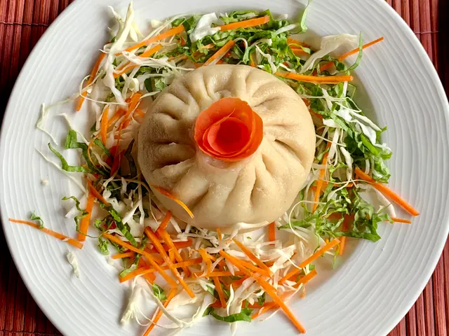 <code>mushroom-greens-bun-b31.webp</code> | 由手持蔬菜卷改为完整蒸包与蔬菜配菜成品。 |
| 番茄牛肉粥 | 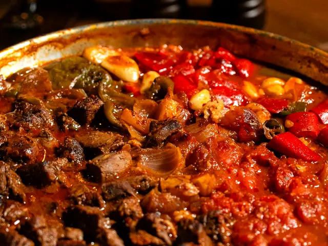 <code>tomato-beef-congee-b31.webp</code> | 换为番茄与牛肉清晰可见的炖煮成品，核心主料更明确。 |
| 丝瓜鸡蛋汤 | 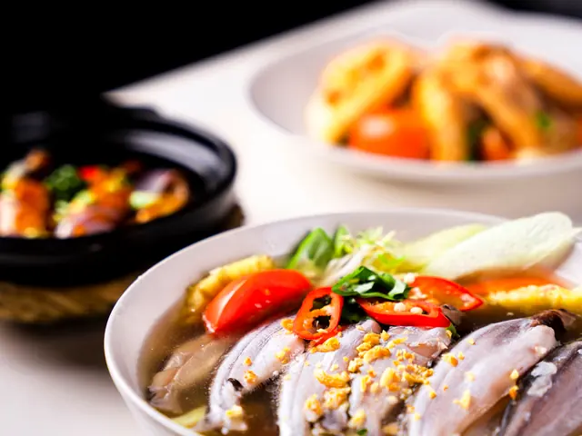 <code>loofah-egg-soup-b31.webp</code> | 由无汤炒蛋改为中式蔬菜清汤，先修正菜型冲突。 |
| 魔芋鸡丝凉拌 | 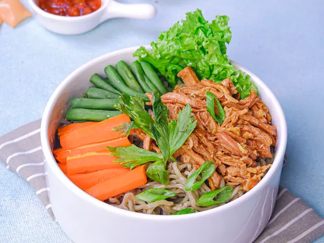 <code>konjac-chicken-salad-b31.webp</code> | 改为鸡丝、细面与蔬菜同碗成品，鸡丝和丝状主食更清楚。 |
| 香菇滑鸡 | 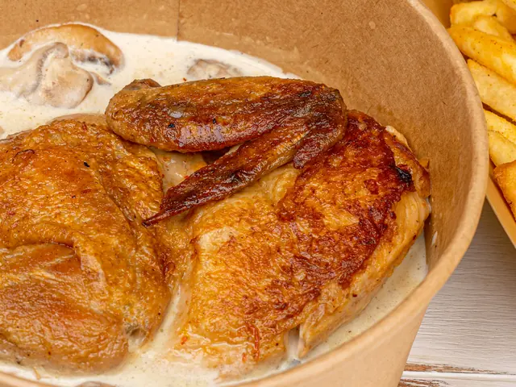 <code>shiitake-silky-chicken-b31.webp</code> | 由疑似意面改为鸡肉与菌菇酱汁近景成品。 |
| 鸡汤娃娃菜 | 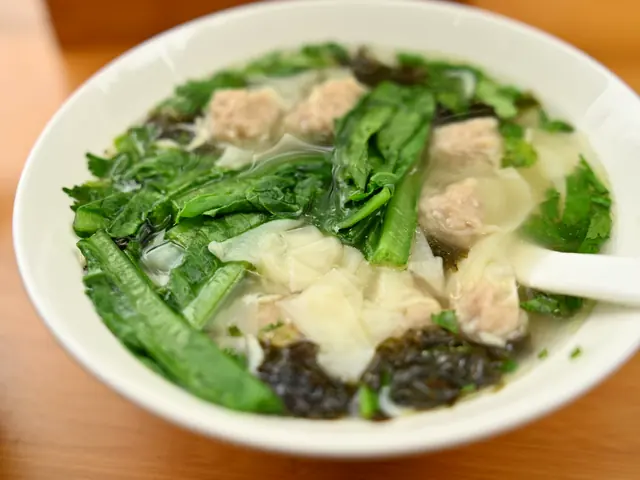 <code>baby-cabbage-chicken-soup-b31.webp</code> | 由玉米胡萝卜汤改为白菜叶菜占主体的中式清汤。 |
| 香菇鸡肉焖饭 | 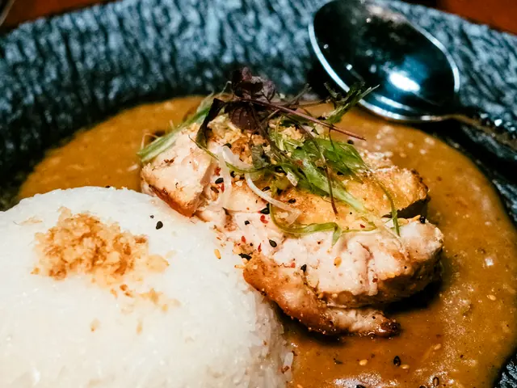 <code>mushroom-chicken-braised-rice-b31.webp</code> | 由分盘套餐改为鸡肉、米饭与浓汁同盘成品。 |
| 凉拌黄瓜鸡蛋 | 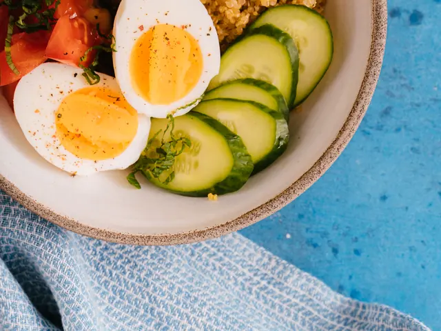 <code>cucumber-egg-salad-b31.webp</code> | 改为黄瓜片与水煮蛋同碗俯拍，核心主料清楚。 |

## P0｜必须换图

这些图片与菜名或成品形态存在确定性冲突。

| # | 菜名 | 当前图片 | 问题 |
|---:|---|---|---|

## P1｜明显问题

主体仍有部分关联，但不足以准确代表该菜。

| # | 菜名 | 当前图片 | 问题 |
|---:|---|---|---|
| 248 | 番茄牛腩盖饭 | 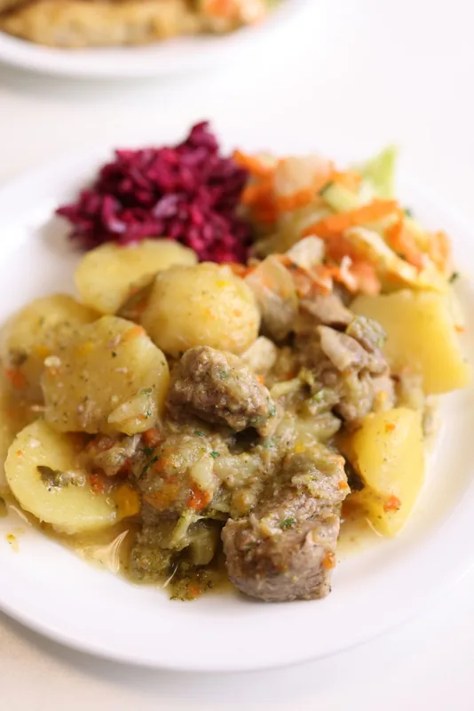 <code>potato-beef-stew.webp</code> | 复用土豆炖牛肉图，画面看不到番茄，且不是盖饭构图。 |
| 252 | 酸辣荞麦面 | 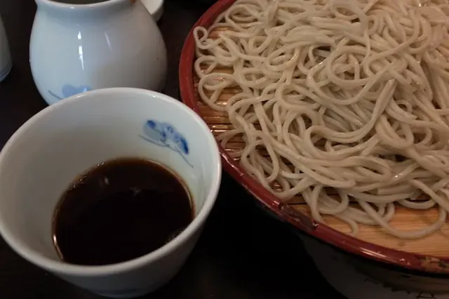 <code>spicy-sour-soba.webp</code> | 画面是原味冷荞麦面，酸辣属性和拌制成品不明显。 |
| 343 | 香菇菜饭 | 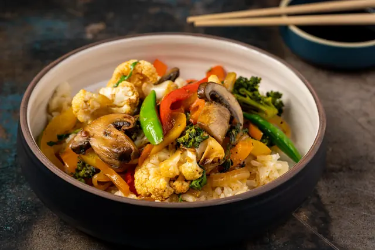 <code>mushroom-vegetable-rice-b5.webp</code> | 画面是菌菇蔬菜碗，米饭主体不清楚。 |
| 361 | 荷香糯米鸡 | 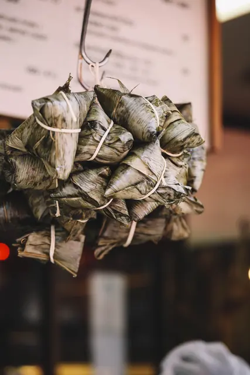 <code>lotus-leaf-sticky-rice-chicken-b6.webp</code> | 画面是成捆粽子/叶包，无法识别荷香糯米鸡成品。 |
| 376 | 胡萝卜玉米排骨汤 | 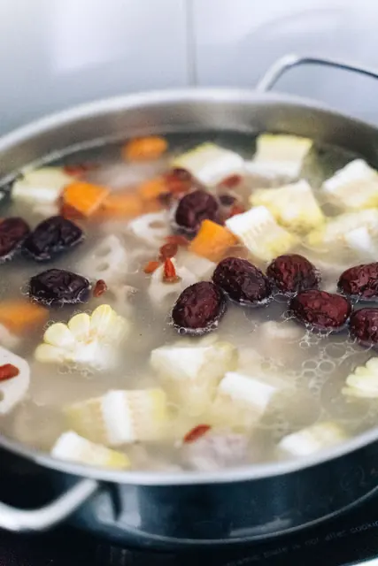 <code>carrot-corn-pork-rib-soup-b7.webp</code> | 玉米、胡萝卜和红枣清楚，但排骨没有可辨识主体。 |
| 397 | 南瓜软欧 | 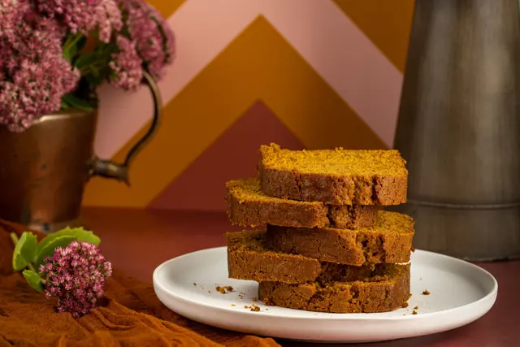 <code>pumpkin-soft-bread-b8.webp</code> | 画面像南瓜蛋糕切片，不像软欧面包。 |
| 404 | 小龙虾拌面 | 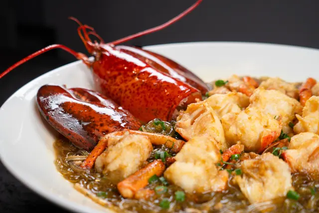 <code>crayfish-noodles-b9.webp</code> | 能看到龙虾肉，但看不到拌面。 |
| 421 | 芹菜炒鸡丝 | 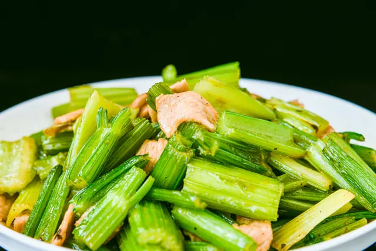 <code>celery-chicken-stir-fry-b10.webp</code> | 芹菜清楚，肉块更像鱼肉/三文鱼，鸡丝特征不成立。 |
| 425 | 柠檬薄荷牛肉 | 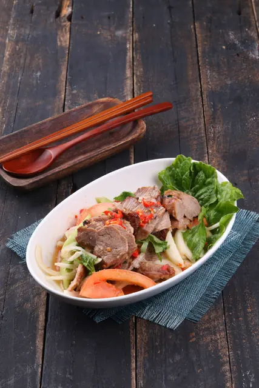 <code>lemon-mint-beef-b10.webp</code> | 牛肉沙拉存在，但柠檬、薄荷都不明显。 |
| 434 | 山药鸡片 | 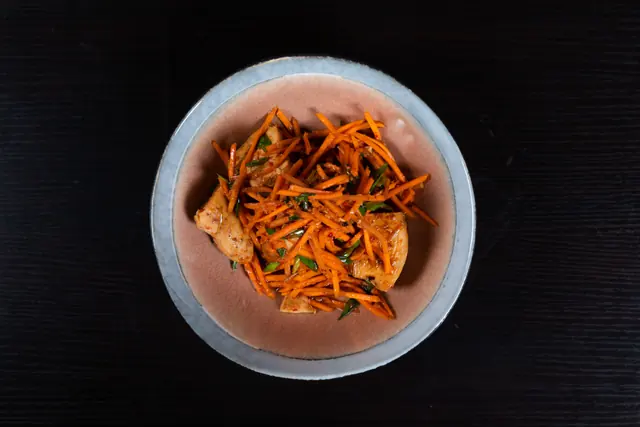 <code>yam-chicken-slices-b10.webp</code> | 画面是胡萝卜丝拌鸡肉，看不到山药。 |
| 445 | 肠旺面 | 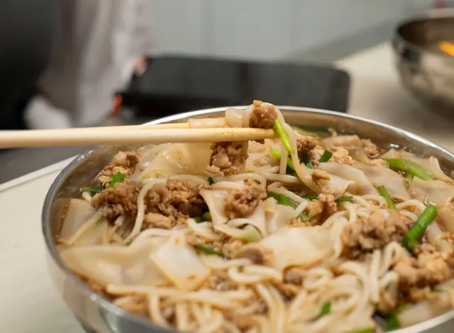 <code>intestine-blood-noodles-b11.webp</code> | 画面是普通肉片汤面，肥肠和血制品都不清楚。 |
| 463 | 葫芦鸡 | 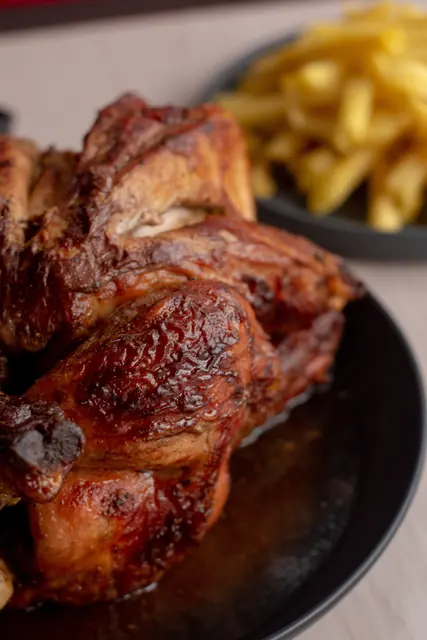 <code>gourd-shaped-fried-chicken-b12.webp</code> | 画面只有整只烤鸡，看不到葫芦。 |
| 465 | 火爆黄喉特辣版 | 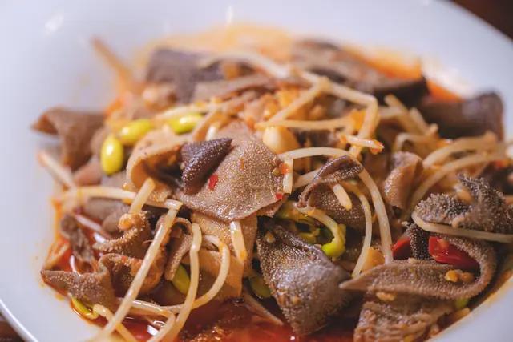 <code>extra-spicy-beef-aorta-b12.webp</code> | 画面更像毛肚/牛杂，黄喉的形态不明确。 |
| 483 | 爆辣牛蛙 | 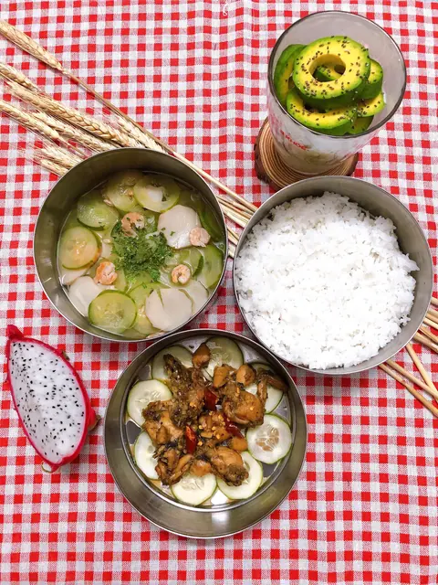 <code>extra-spicy-frog-b13.webp</code> | 画面是组合套餐，牛蛙主体无法辨认。 |
| 505 | 上汤娃娃菜 | 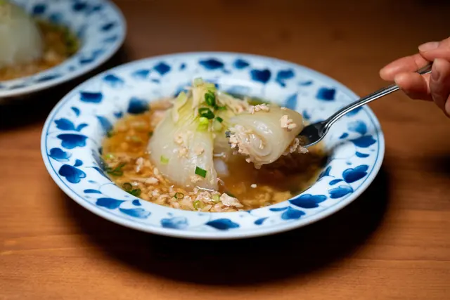 <code>superior-broth-baby-cabbage-b15.webp</code> | 画面像单个菜卷/丸子，看不出上汤娃娃菜。 |
| 611 | 番茄疙瘩汤 | 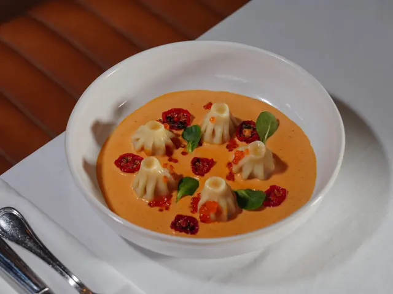 <code>tomato-dumpling-soup-b20.webp</code> | 画面是西式番茄浓汤配造型面点，不符合中式番茄疙瘩汤的成品形态。 |
| 648 | 青咖喱虾 | 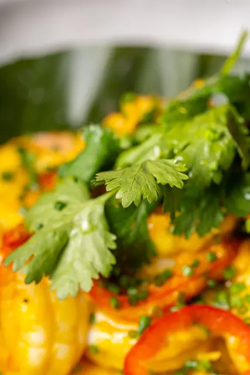 <code>green-curry-shrimp-b22.webp</code> | 主体被香菜近景遮住，青咖喱虾几乎无法识别。 |
| 663 | 炝拌土豆片 | 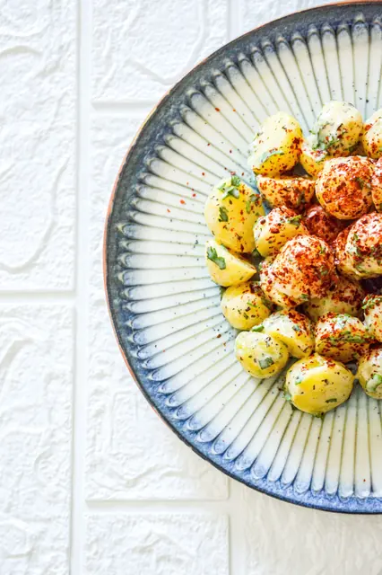 <code>spicy-potato-salad-b22.webp</code> | 画面是整颗小土豆沙拉，不是炝拌土豆片。 |
| 714 | 豉汁排骨煲仔饭 | 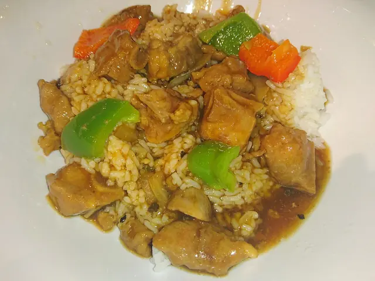 <code>black-bean-ribs-rice-b25.webp</code> | 画面更像鸡肉盖饭，看不到排骨和煲仔锅。 |
| 720 | 芋头排骨煲 | 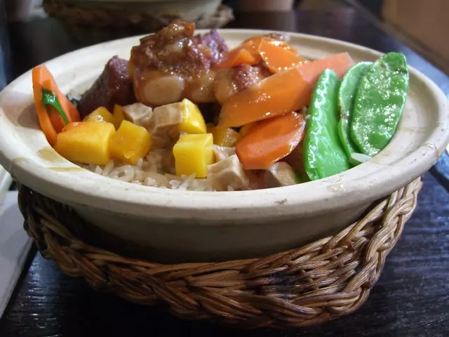 <code>taro-ribs-claypot-b25.webp</code> | 画面是彩椒肉类盖饭，芋头与排骨都不明确。 |
| 771 | 笋干老鸭煲 | 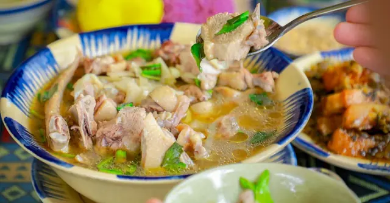 <code>duck-bamboo-soup-b28.webp</code> | 画面是浅色肉汤，笋干与老鸭都不易辨认。 |
| 786 | 酸豆角炒鸡胗 | 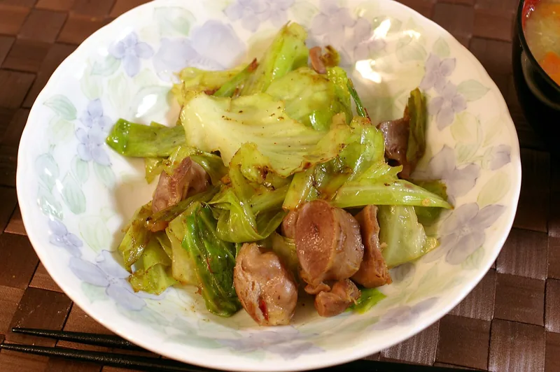 <code>pickled-pepper-chicken-gizzard.webp</code> | 画面是鸡胗炒卷心菜，看不到酸豆角。 |
| 788 | 羊蝎子火锅 | 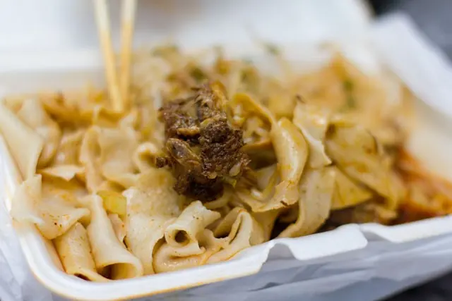 <code>lamb-spine-b29.webp</code> | 画面是干拌宽面与肉片，不是羊蝎子火锅。 |
| 791 | 番茄虾仁年糕 | 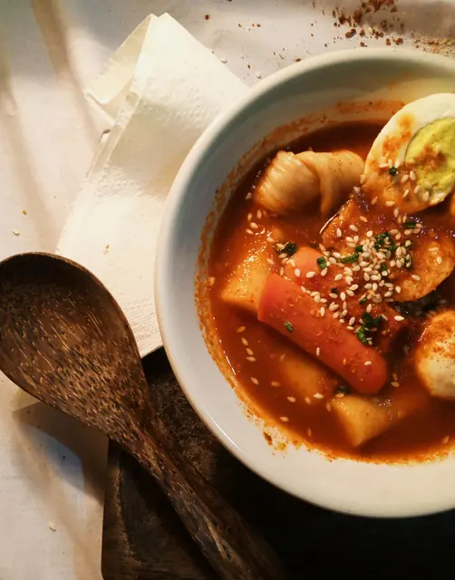 <code>spicy-rice-cakes-b17.webp</code> | 年糕存在，但番茄与虾仁都不清楚。 |
| 792 | 尖椒护心肉 | 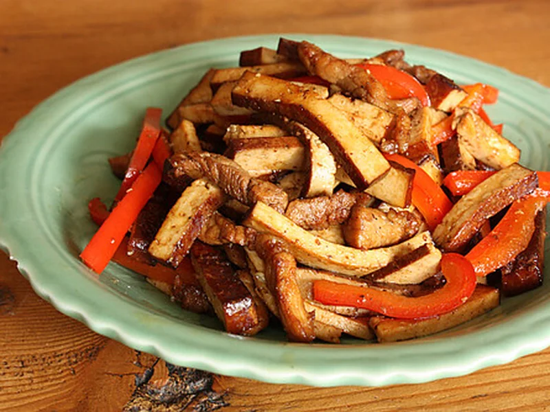 <code>smoked-tofu-pepper-pork.webp</code> | 复用豆干炒肉图，护心肉特征不成立。 |
| 793 | 干锅藕片鸡翅 | 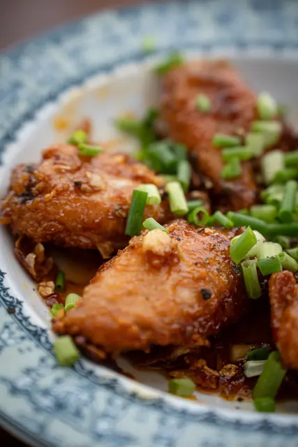 <code>dry-pot-chicken-wings-b20.webp</code> | 画面只有鸡翅，看不到藕片。 |
| 802 | 泡椒肉丝 | 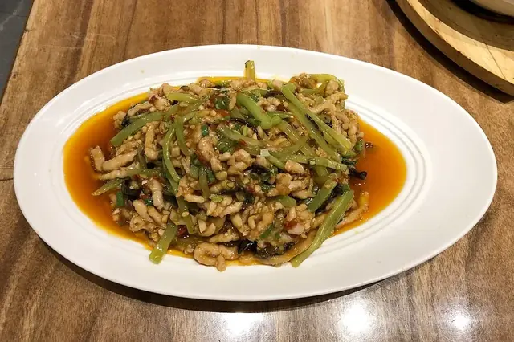 <code>fish-flavored-shredded-pork.webp</code> | 复用鱼香肉丝图，看不到泡椒特征。 |
| 809 | 玉米馒头 | 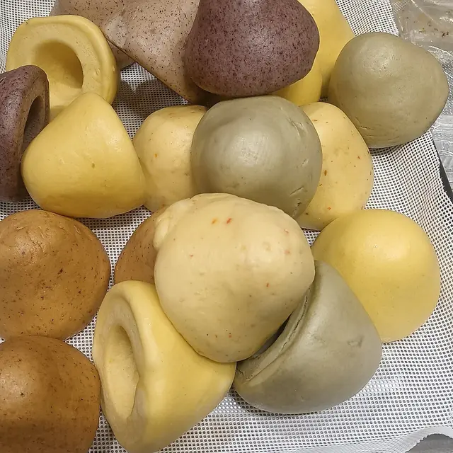 <code>corn-wotou-b30.webp</code> | 画面是多色、多形状面点，玉米馒头主体不明确。 |

## P2｜品质与食欲感偏弱

菜名大体可对应，但图片本身不适合作为产品主图。

| # | 菜名 | 当前图片 | 问题 |
|---:|---|---|---|
| 50 | 清蒸排骨 | 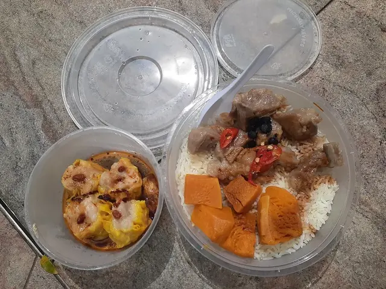 <code>cantonese-steamed-ribs.webp</code> | 一次性餐盒与分装配菜占据主体，完成度低。 |
| 91 | 藤椒鸡 | 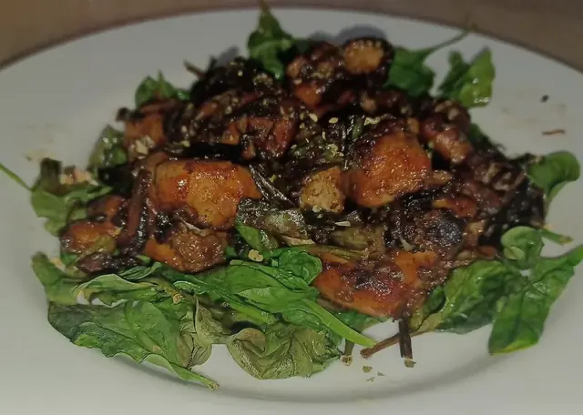 <code>sichuan-pepper-chicken.webp</code> | 整体偏暗偏绿，鸡肉表面发黑。 |
| 112 | 干锅肥肠 | 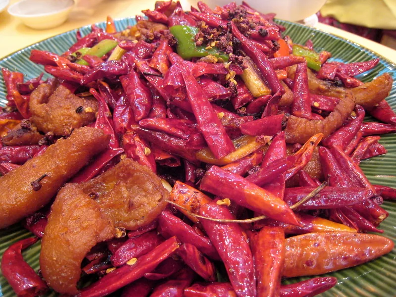 <code>dry-pot-pork-intestines.webp</code> | 油亮发红且画面拥挤，食欲感偏弱。 |
| 122 | 酸辣米线 | 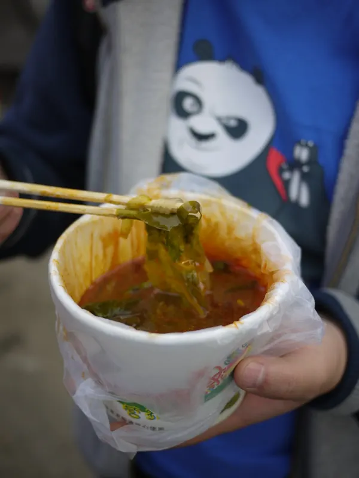 <code>hot-sour-rice-noodles.webp</code> | 手持一次性碗且主体被夹起遮挡，像随手拍。 |
| 129 | 杭州片儿川 | 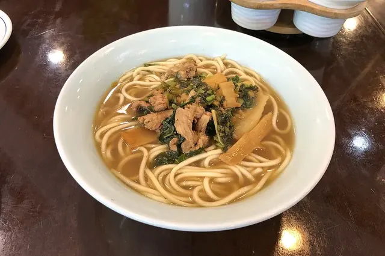 <code>pianerchuan.webp</code> | 光线平、汤面灰，整体像普通记录照。 |
| 157 | 炒方便面升级版 | 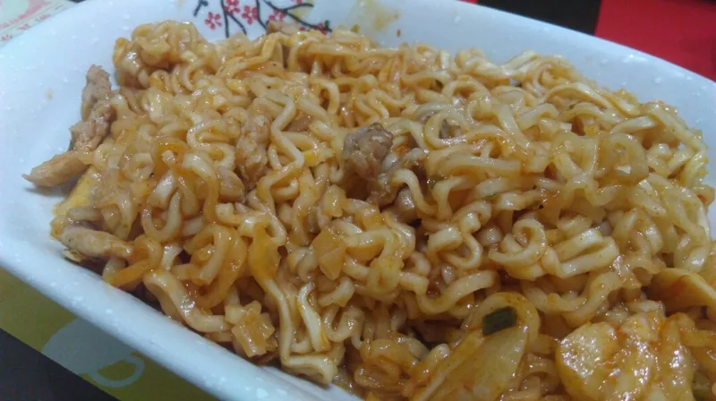 <code>fried-instant-noodles.webp</code> | 颜色单一、油腻，构图像随手拍。 |
| 163 | 雪菜肉丝 | 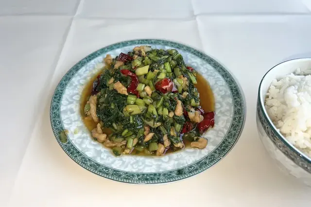 <code>xuecai-shredded-pork.webp</code> | 菜量小、桌面空，雪菜肉丝主体不突出。 |
| 189 | 手撕包菜 | 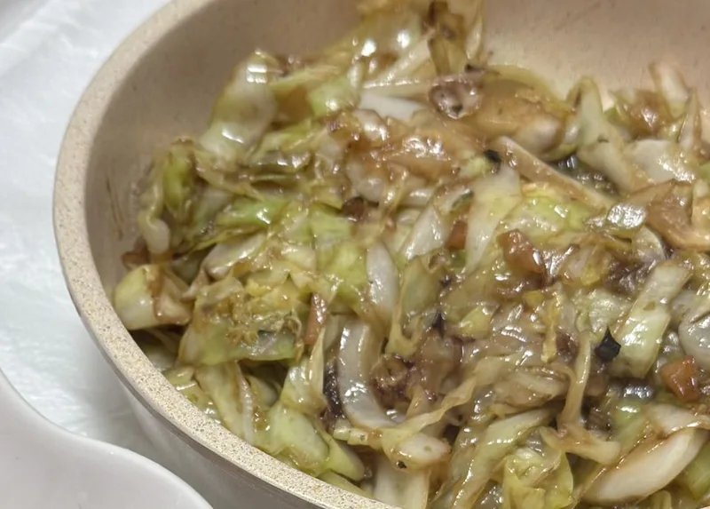 <code>hand-torn-cabbage.webp</code> | 包菜软烂发灰，汤汁黏稠。 |
| 203 | 炝炒莲白 | 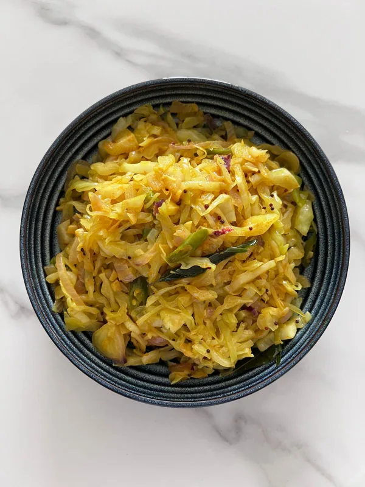 <code>quick-fried-cabbage.webp</code> | 菜叶发黄软塌，卖相偏旧。 |
| 208 | 青椒猪肝 | 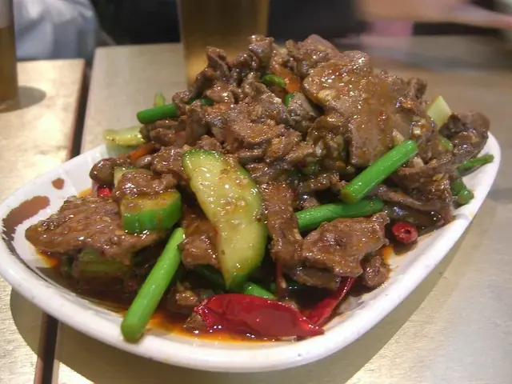 <code>spicy-pork-liver.webp</code> | 闪光直打、色泽发灰，猪肝质感不佳。 |
| 216 | 火爆腰花 | 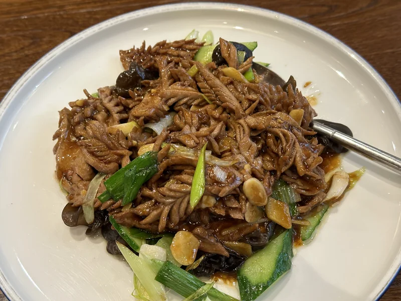 <code>wok-fried-pork-kidney.webp</code> | 画面暗、面条黏成团，腰花不突出。 |
| 226 | 紫薯鸡蛋卷 | 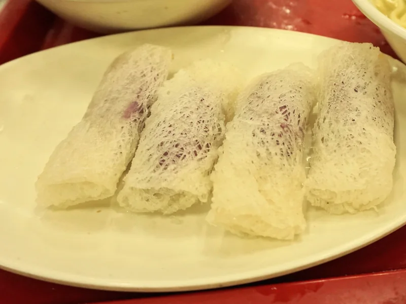 <code>purple-sweet-potato-roll.webp</code> | 整体惨白、对比度低，紫薯特征很弱。 |
| 232 | 麻辣豆腐丝 | 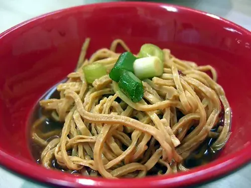 <code>spicy-beancurd-shreds.webp</code> | 看起来像普通面条，豆腐丝质感不清楚。 |
| 233 | 麻辣拌豆皮 |  <code>spicy-beancurd-shreds.webp</code> | 看起来像普通面条，豆皮质感不清楚。 |
| 237 | 蒜苗盐煎肉 | 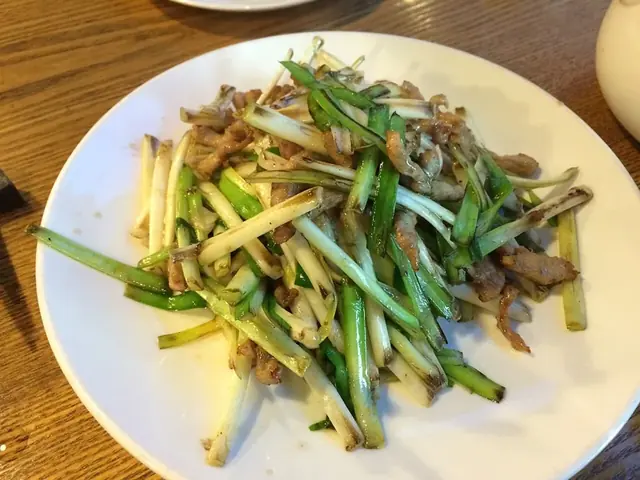 <code>garlic-chive-pork.webp</code> | 菜量少、色泽灰黄，蒜苗与腊肉都不突出。 |
| 345 | 肉夹馍 | 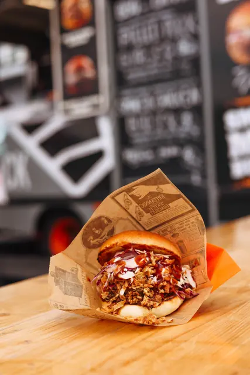 <code>pulled-pork-sandwich-b5.webp</code> | 汉堡被包装纸与画面边缘遮挡。 |
| 394 | 紫薯芋泥杯 | 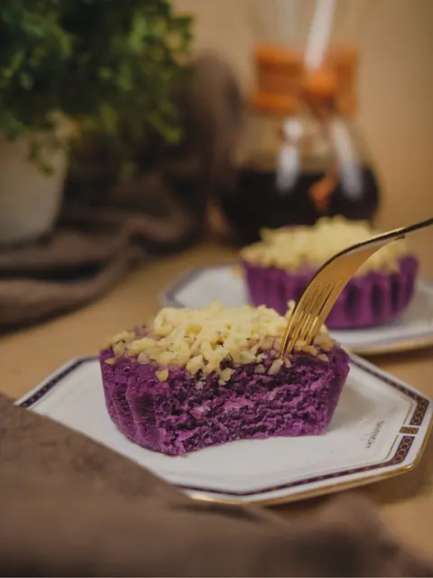 <code>purple-yam-dessert-cup-b8.webp</code> | 甜品杯边缘凌乱、主体被切掉，卖相差。 |
| 415 | 香茅烤鱼 | 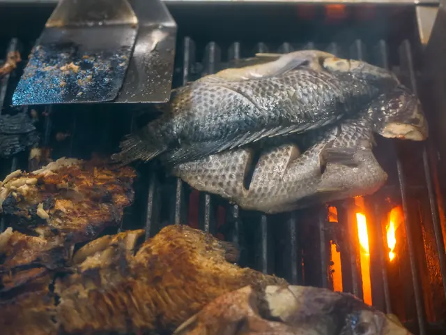 <code>lemongrass-grilled-fish-b9.webp</code> | 烟雾重、烤架脏乱，鱼像未完成加工态。 |
| 430 | 红豆薏米水 | 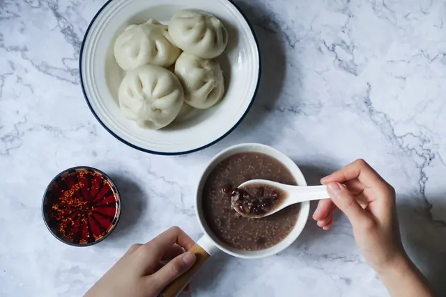 <code>red-bean-barley-water-b10.webp</code> | 包子与多人手部同框，饮品主体被弱化。 |
| 433 | 玉米鸡蛋杯 | 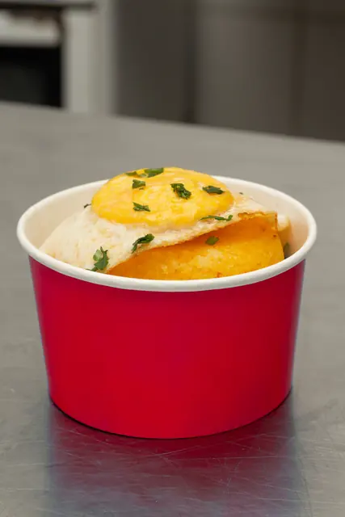 <code>corn-egg-cup-b10.webp</code> | 一次性红纸杯、画面扁平，像快餐记录照。 |
| 437 | 烤冷面 | 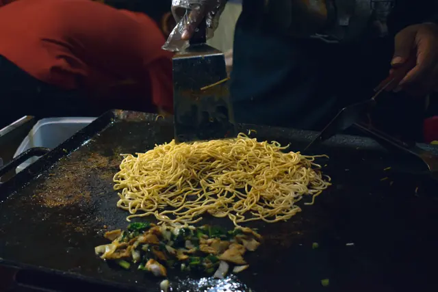 <code>grilled-cold-noodles-b11.webp</code> | 后厨铁板和人物手部占主体，完成态不干净。 |
| 460 | 爆辣肥肠 | 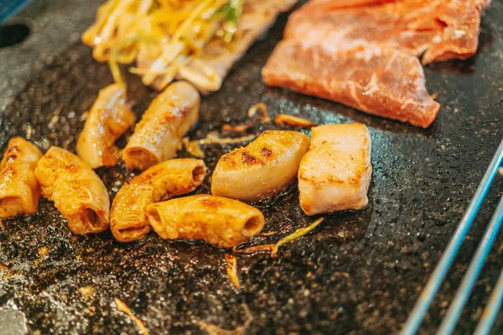 <code>extra-spicy-pork-intestine-b12.webp</code> | 铁板加工过程图，背景杂乱且食材焦黑。 |
| 477 | 鸡蛋酱拌菜 | 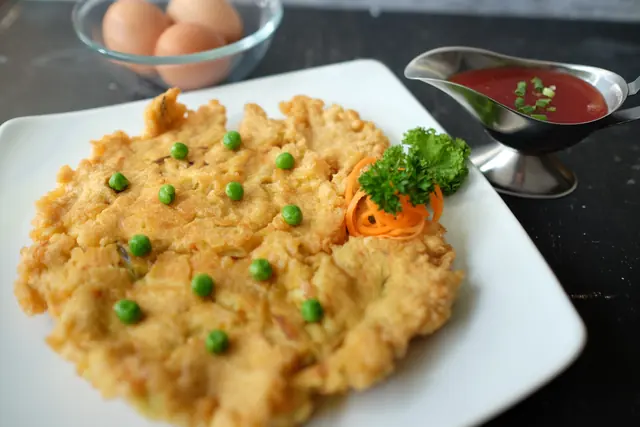 <code>egg-sauce-mixed-vegetables-b13.webp</code> | 蛋酱糊成一团，色泽灰黄、食欲感低。 |
| 512 | 鲜肉芽菜包 | 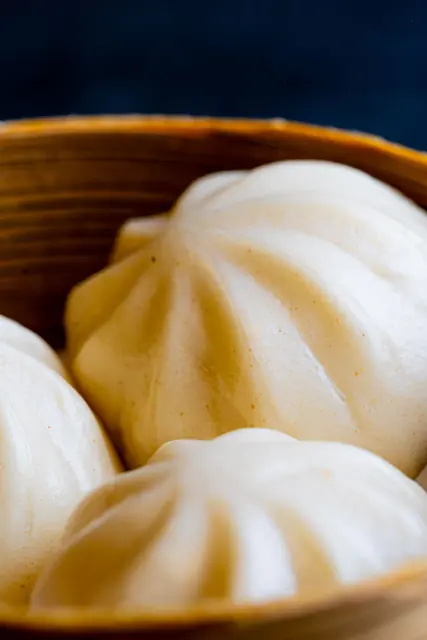 <code>pork-preserved-vegetable-bun-b15.webp</code> | 包子被极端裁切，只看到表皮局部。 |
| 617 | 酒酿圆子 | 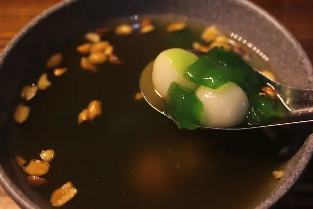 <code>sweet-rice-dumpling-soup-b20.webp</code> | 背景几乎全黑，只剩一勺圆子局部。 |
| 665 | 酸奶戚风低糖 | 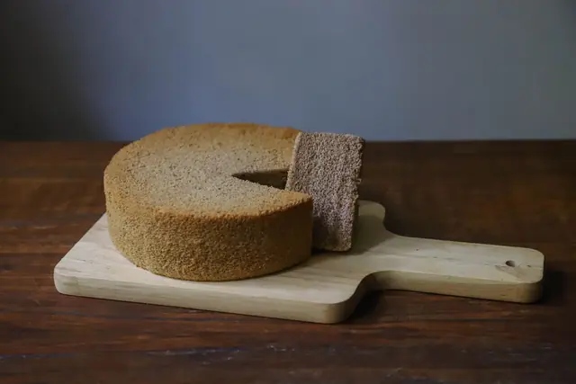 <code>low-sugar-yogurt-chiffon-b23.webp</code> | 蛋糕小且颜色发灰，酸奶戚风卖相弱。 |
| 690 | 薄荷绿豆水 | 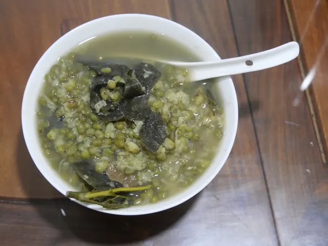 <code>mint-mung-bean-drink-b24.webp</code> | 绿豆水呈灰绿色稠粥状，食欲感低。 |
| 695 | 葱花卷 | 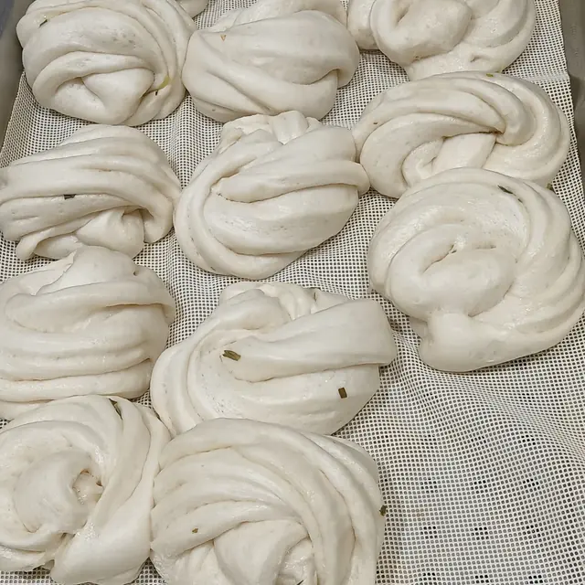 <code>scallion-flower-roll-b24.webp</code> | 花卷惨白、无配菜、批量陈列感强。 |
| 710 | 青椒洋芋丝 | 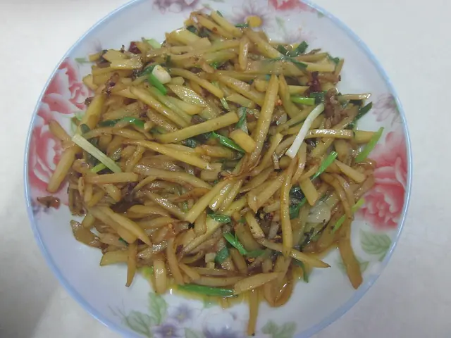 <code>green-pepper-potato-shreds-b25.webp</code> | 低清、偏黄，土豆丝软塌。 |
| 718 | 浆水面 | 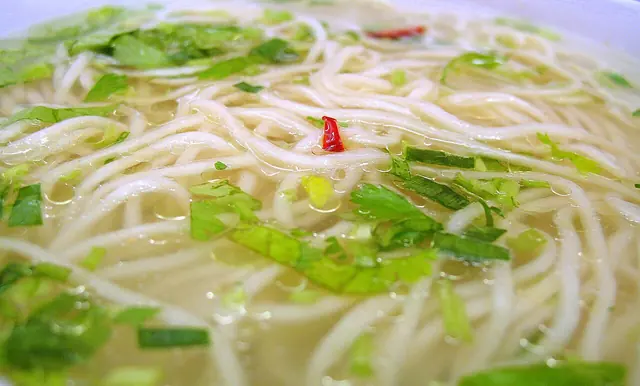 <code>jiangshui-noodles-b25.webp</code> | 汤水近乎无色，配料少，成品寡淡。 |
| 721 | 羊肉萝卜汤 | 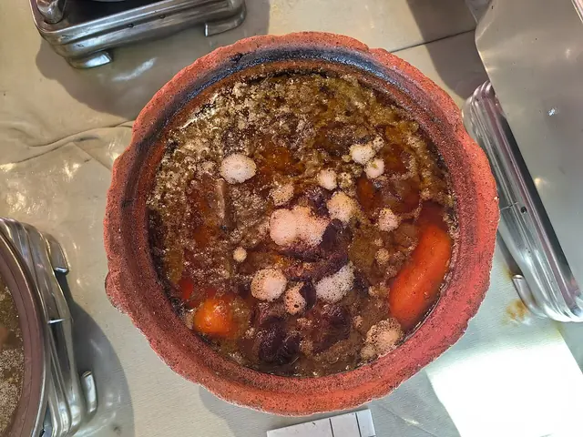 <code>lamb-radish-soup-b25.webp</code> | 汤色发黑发油，萝卜主体不清楚。 |
| 729 | 紫薯牛奶 | 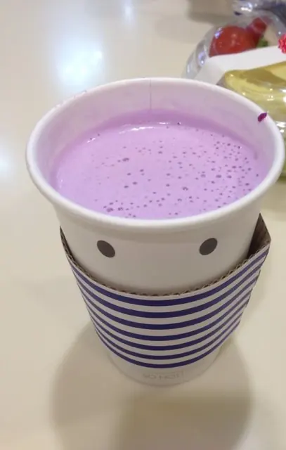 <code>purple-sweet-potato-milk-b26.webp</code> | 一次性杯与隔热套，画质低且颜色失真。 |
| 734 | 椒盐花卷 | 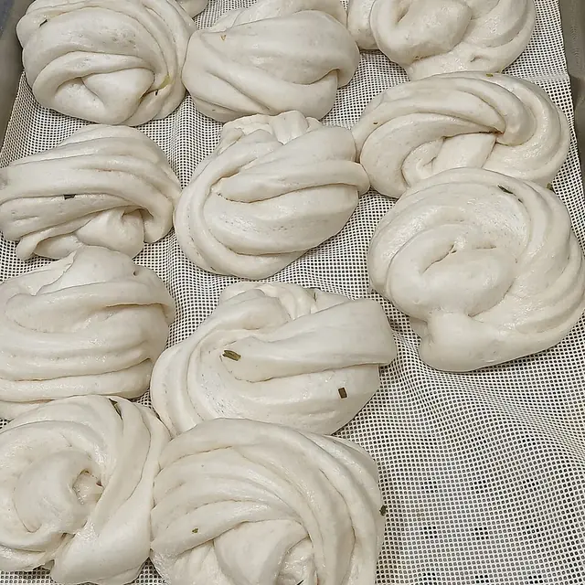 <code>pepper-salt-flower-roll-b26.webp</code> | 花卷惨白、无配菜、批量陈列感强。 |
| 742 | 番茄羊肉面 | 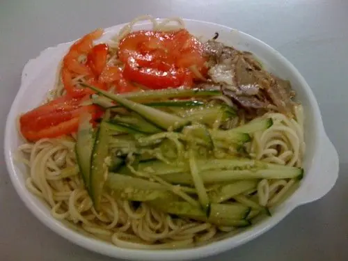 <code>tomato-lamb-noodles-b26.webp</code> | 画质低、色偏灰绿，面条软塌。 |
| 764 | 小米辣脑花 | 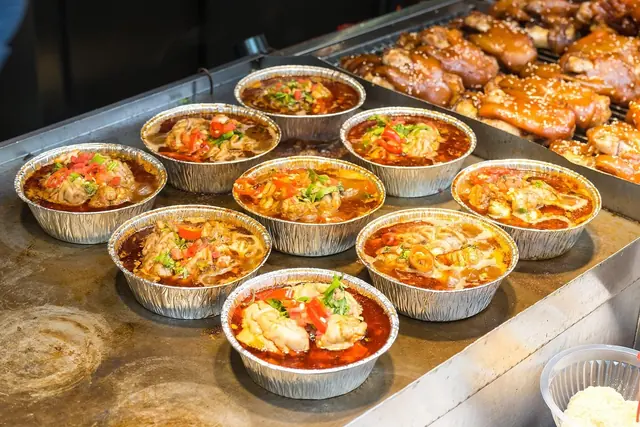 <code>spicy-pork-brain-b28.webp</code> | 后厨铝盒批量陈列，画面杂乱。 |
| 765 | 香辣脑花 |  <code>spicy-pork-brain-b28.webp</code> | 后厨铝盒批量陈列，画面杂乱。 |
| 769 | 葱烧木耳 | 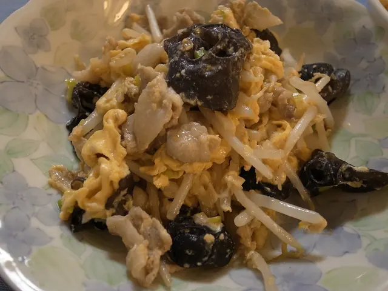 <code>wood-ear-pork-stir-fry-b28.webp</code> | 近距离随手拍，菜体糊成一团、颜色发灰。 |
| 808 | 爆辣兔头 | 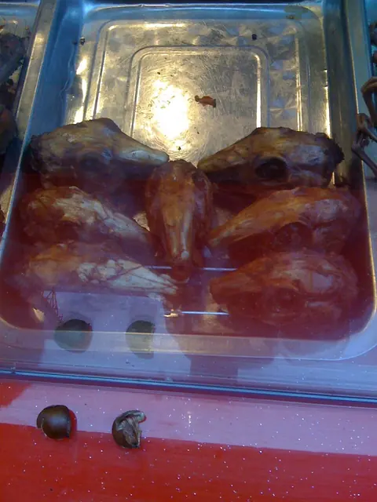 <code>rabbit-head-b30.webp</code> | 兔头堆在蓝色塑料箱内，隔着箱体拍摄，清晰度和食欲感都很差。 |
